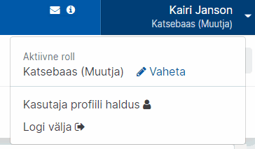
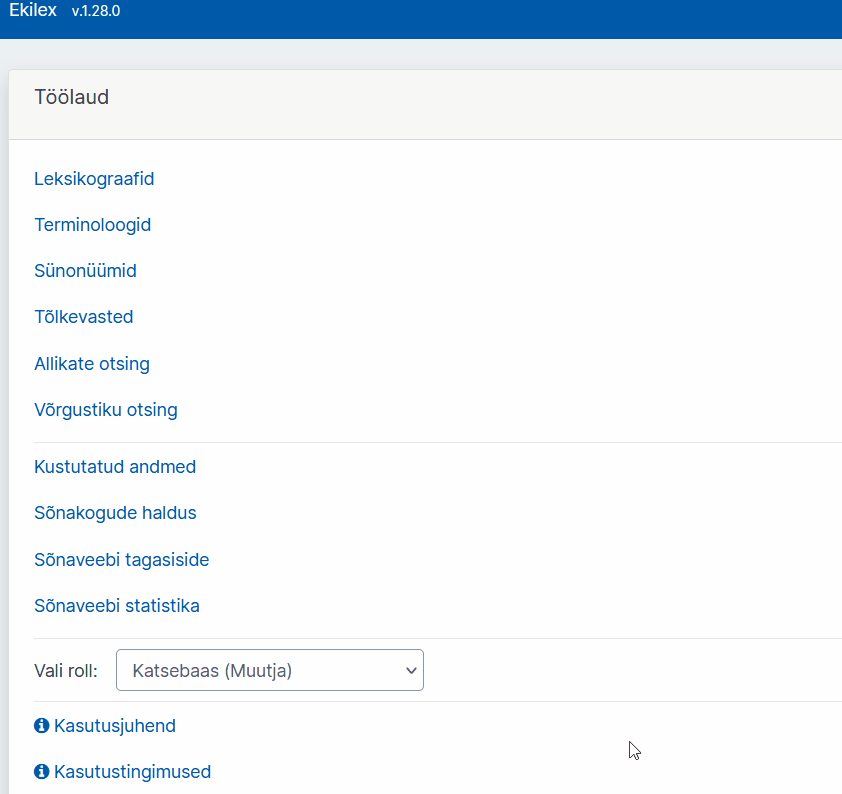
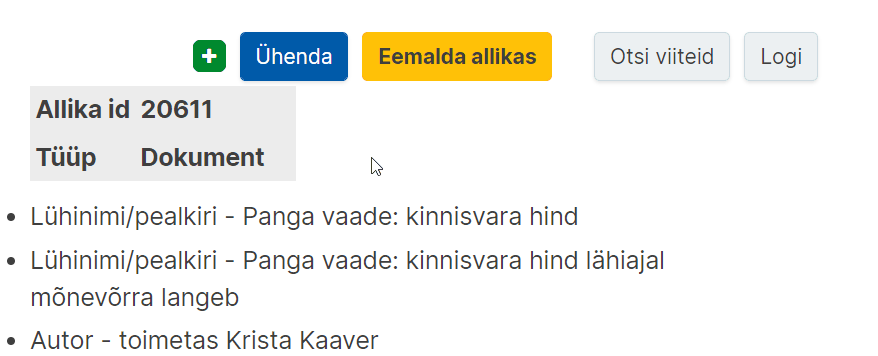

# Ekilexi kasutusjuhend

<button>[Avaleht](/index.md)</button>
<button>[Terminitöö sõnakoguga](/terminitoo.md)</button>

## Avaleht 

### Sisukord
- [Mis on Ekilex?](#mis-on-ekilex)
- [Kasutajaks registreerumine ja õiguste taotlemine](#kasutajaks-registreerumine-ja-õiguste-taotlemine)
  - [Edaspidi õiguste taotlemine](#edaspidi-õiguste-taotlemine)
  - [Terminibaasis muudatuste tegemine](#terminibaasis-muudatuste-tegemine)
- [Töölaud](#töölaud)
- [Katsetamine ja proovikirjete koostamine](#katsetamine-ja-proovikirjete-koostamine)
- [Kirjete muutmine pärast valmimist](#kirjete-muutmine-pärast-valmimist)
- [Uue sõnakogu loomine](#uue-sõnakogu-loomine)
  - [Sõnakogu muutmisõigused](#sõnakogu-muutmisõigused)
- [Allikad](#allikad)
  - [Allikate otsing](#allikate-otsing)
    - [Konkreetse allika viited mõistekirjetes](#konkreetse-allika-viited-mõistekirjetes)
    - [Kõikide terminibaasis viidatud allikate kuvamine](#kõikide-terminibaasis-viidatud-allikate-kuvamine)
  - [Allika loomine](#allika-loomine)
    - [Raamatu allikakirje näide](#raamatu-allikakirje-näide)
    - [Eesti õigusakti allikakirje näide](#eesti-õigusakti-allikakirje-näide)
    - [Euroopa Liidu õigusakti allikakirje näide](#euroopa-liidu-õigusakti-allikakirje-näide)
  - [Allika muutmine](#allika-muutmine)
  - [Allika kustutamine](#allika-kustutamine)
  - [Allikate ühendamine](#allikate-ühendamine)
- [Mõistekirja, termini või muu kirje osise lisaja kuvamine](#mõistekirja-termini-või-muu-kirje-osise-lisaja-kuvamine)
    
---

### Mis on Ekilex?

Ekilex on Eesti Keele Instituudi sõnastiku- ja terminibaasisüsteem. Ekilex asub aadressil <a href="https://ekilex.ee/" target="_blank">ekilex.ee</a> ja on kõigile, kes soovivad oma terminibaasi koostada, tasuta kasutatav. 

Kui Ekilex on töötamiskeskkond, siis kogu Ekilexi sisestatud teave saab kõigile avalikuks  <a href="https://sonaveeb.ee/" target="_blank">Sõnaveebis</a> – avalikus kasutajakeskkonnas.

**Sõnaveeb on Eesti Keele Instituudi keeleportaal**, kuhu on koondatud info instituudi paljudest sõnakogudest ja andmebaasidest (sh terminibaasidest). Sõnaveebi kasutavad iga kuu kümned tuhanded inimesed.

Sõnaveebis on koos nii üldkeeleteave (EKI ühendsõnastik, mille eest vastutavad EKI keeleteadlased) kui ka teave arvukatest terminibaasidest, mida Ekilexis koostatakse.

Sõnaveeb asub aadressil <a href="https://sonaveeb.ee/" target="_blank">https://sonaveeb.ee</a>.

Sõnaveebi otsingutulemustes kuvatakse **ülevalpool üldkeelesõnastikus leiduv teave, allpool aga oskussõnastikes ja terminibaasides leiduv teave**. Niisiis peate mõnikord võib-olla lehte allapoole kerima, et erialakeelega seonduvaid andmeid näha. Lugege <a href="https://terminoloogia.ee/ufaqs/mis-vahe-on-uld-ja-oskuskeelel/" target="_blank">siit</a> lähemalt, mis eristab eriala- ehk oskuskeelt üldkeelest.

   

Pilt: Sõnaveebi vaade. Kirja “Oskussõnastikud” alt (pildil märgitud oranži kastikesega) leiate terminibaasidesse kantud teabe.

*Allikas: <a href="https://terminoloogia.ee/ufaqs/mis-on-sonaveeb-ja-kuidas-on-see-seotud-ekilexiga/" target="_blank">terminoloogia.ee</a>*

---

### Kasutajaks registreerumine ja õiguste taotlemine

1. Ekilexi kasutamiseks tuleb luua endale **kasutajakonto**. Selleks minge Ekilexi avalehele ja vajutage nuppu „Loo kasutaja“.

2. Avaneb kasutajaks registreerumise vorm. Peate sisestama oma **ees- ja perekonnanime**, **e-posti aadressi** ja valima **parooli**, mille sisestate kaks korda. 

3. Peate ka läbi lugema **kasutustingimused** ja kinnitama nendega nõusoleku.

4. Seejärel klõpsake nupul **„Registreeru“**. 

5. Mõne sekundi jooksul saadetakse teie e-postkasti **kinnituskiri**. Kui kirja pole tulnud, vaadake ka rämpsposti kataloogi või trükkige otsingureale „Ekilexi kasutaja registreerimine“. Oma konto aktiveerimiseks peate klõpsama kinnituskirjas saadetud **aktiveerimislingil**.  
  
    Pilt: Näide kasutaja registreerimise kinnituskirjast 

6. Pärast lingil klõpsamist avaneb Ekilexi sisselogimisvorm koos teatega „Kasutaja on aktiveeritud, head kasutamist“.

7. Sisselogimiseks sisestage oma e-posti aadress ja eelnevalt valitud parool ning klõpsake nupul **„Sisene“**.

8. Kui olete sisse loginud, avaneb **õiguste taotlemise leht**, kus on teade: „See on EKI sõnastiku- ja terminibaasisüsteem Ekilex. Kui vaja, vali sõnakogud, millele soovid muutmisõigust.“  
    
Pilt: Avaleht esimesel sisselogimisel

+ **Vaatamisõiguse** saamiseks vajutage lihtsalt „Hakka Ekilexi kasutama“. Selle valikuga saate ka muutmisõiguse „Katsebaasile“, kus saab katsetada andmete sisestamist.

+ **Muutmisõiguste** taotlemiseks olemasolevale sõnakogule: 
    1. Vajutage **„Soovin sõnakogude muutmisõigust“** ja valige soovitud sõnakogu(d), mille autorite hulka te kuulute. Pole mõtet valida sõnakogusid, millega teil puudub seos.
    2. Muutmisõiguse taotlemise korral vajutage ka „Soovin põhjendada taotlust“ ja kirjutage lahtrisse lühidalt, kuidas olete sõnakoguga seotud. **Põhjendus on kohustuslik**.
    3. Seejärel vajutage **„Saada taotlus“**.
    4. Nüüd tuleb oodata, kuni Ekilexi administraator annab teile küsitud õigused. **Selle kohta saadetakse e-kiri**. Pärast seda saate hakata Ekilexi kasutama. Kui olete õiguste saamise hetkel (e-kirja saabumise hetkel) Ekilexi sisse logitud, peate kõigepealt välja logima ja siis uuesti sisse logima, selleks, et õigused rakenduksid.

#### Edaspidi õiguste taotlemine

Kui olete juba ekilexi vaatamisõiguse või mõne sõnakogu muutmisõigused omandanud, saate teiste sõnakogude õigusi omandada järgmiselt:

<!-- Hetkel vaid testbaasis selline? -->
<!--2. Profiilihalduse lehel on sinine nupp **"Esita uus taotlus"**. Sellele klõpsates avaneb taotluse saatmise aken. Pead **valima sõnakogu**, millele õiguseid taotleda, k**as soovid Muutja või Lugejaõigusi** ning **mis keeles**. Samuti tuleb lisada **põhjendus**, miks soovite sellele sõnakogule ligipääsu. Seejärel vajuta "Saada taotlus".
  
Pilt:-->

1. Klõpsake üleval **sinise riba paremal pool** oma nimele ja avage "Kasutaja profiili haldus".  
   
Pilt: Kasutaja klõpsamisel ilmuv rippmenüü

2. Profiilihalduse lehel on sinine nupp **"Esita uus taotlus"**. Sellele klõpsates avaneb **taotluse saatmise aken**. Seal saab lisada **põhjenduse**, miks soovite sõnakogudele ligipääsu. 
  
Pilt: Taotluse akna avamine ja põhjuse lisamine

3. Vajutades nuppu "Märgi sõnakogud, millele soovid õigusi" avaneb nimekiri sõnakogudest. **Märgi linnukesega** need, millele soovid õigusi, ning vajuta **"Saada taotlus"**.  
  
Pilt: Vajutades nuppu tekstikasti all avaneb nimekiri, kus saab linnukesega märkida sõnakogud

4. Taotluste info on näha **"Esitatud õiguste taotlused"** all.  
   
Pilt: Esitatud taotluse info tabelina

#### Terminibaasis muudatuste tegemine

Kui olete terminibaasi loonud, on teil õigused sinna mõistekirjeid lisada ja seal muid muudatusi teha. Kui näete, et ei saa oma terminibaasis muudatusi teha, võib probleem olla selles, et **valitud on vale sõnakogu muutja roll.**

Kõik Ekilexi kasutajad saavad liitudes katsebaasi muutmisõigused ehk katsebaasi muutja rolli. Kui luuakse uus terminibaas, on rolle, mille vahel valida, kaks. Kui te ei saa enda terminibaasis muutusi teha, on võimalik, et olete kogemata jäänud katsebaasi muutja rolli. **Enda rolli näeb ja saab muuta ülevalt sinise riba paremast nurgast oma nime alt. Peaksite sealt valima oma terminibaasi muutja rolli.**

1. Klõpsake üleval **sinise riba paremal pool** oma nimele.  
    
Pilt: Kasutajale klõpsamisel ilmuv rippmenüü

2. Kui soovite rolli vahetada, vajutage **“Vaheta”**.  
  
Pilt: Klõpsake "Vaheta"

3. Klõpsake avanenud lehel kirja **“Vali roll”** järel olevale väljale ja **valige menüüst sobiv roll**.  
   
Pilt: Rippmenüüst rolli valimine

*Allikas: <a href="https://terminoloogia.ee/ufaqs/miks-ma-ei-saa-enda-terminibaasis-muudatusi-teha/" target="_blank">terminoloogia.ee</a>*

---

### Töölaud

Pärast sisselogimist satub kasutaja töölauale. Töölauaks nimetame Ekilexi avalehte sisselogitud olekus, millele pääseb igalt lehelt, klõpsates vasakult ülanurgast avanevat rakenduse menüüd ja valides „Ekilex“.

Järgnevalt on kirjeldatud töölaual asuvad funktsionaalsed valikud:
- **Leksikograafid:** sõnapõhine vaade sõnakogudele, mõeldud tööks leksikograafidele
- **Terminoloogid:** mõistepõhine vaade sõnakogudele, mõeldud tööks terminoloogidele
- **Sünonüümid:** vaade sünonüümiseoste moodustamiseks
- **Tõlkevasted:** vaade kakskeelsete (hetkel eesti-inglise) tõlkeseoste moodustamiseks.
- **Allikate otsing:** allikate otsing, lisamine, muutmine, kustutamine
- **Kustutatud andmed:** võimaldab näha nimekirja kustutatud terminitest või mõistetest. Otsingufunktsioon puudub
- **Sõnakogude haldus:** kõigi Ekilexis leiduvate sõnakogude loend ja lisamine, muutmine, kustutamine
- **Sõnaveebi tagasiside:** võimalus lugeda Sõnaveeb.ee saidile jäetud tagasisidet
- **Vali roll:** rippmenüü rolli valikuks. Siin tuleb valida selle sõnakogu muutja roll, milles olevaid andmeid soovid muuta. Kasutaja saab samaaegselt muuta ainult ühe sõnakogu andmeid. Muutja rolli olemasolu eelduseks on vastava sõnakogu muutmise õigus. Õiguseid saab juurde taotleda [kasutaja profiili halduses](#edaspidi-õiguste-taotlemine).

Terminitööks soovitame kasutada terminoloogide otsingut ehk terminoloogi vaadet. Selle kasutamise kohta on laiemalt kirjutatud [Terminitöö kasutusjuhendis](/terminitoo.md).

---

### Katsetamine ja proovikirjete koostamine

Ekilexis on üks terminibaas, mis ongi mõeldud katsetamiseks – **Katsebaas**. Katsebaasis võib mõistekirjeid luua igaüks olenemata sellest, mis valdkonna terminoloogiaga ta muidu töötab. Katsebaasi muutmisõigus on igal Ekilexi kasutajal ja seda ei pea eraldi taotlema. Katsebaasi kirjed ei muutu Sõnaveebis avalikuks ja jäävad alati vaid Ekilexi.

Selleks, et Katsebaasis kirjete koostamist katsetada, peaksite tegema läbi järgmised sammud:

1. Valima Ekilexis Töölaual **Katsebaasi muutja rolli** (lugege rollidest ja nende vahetamisest lähemalt [siit](#terminibaasis-muudatuste-tegemine))  
   
Pilt: Töölaual katsebaasi muutja rolli valimine

2. **Minema terminoloogide vaatesse**.  
  
Pilt: Terminoloogide vaatesse minemine

3. Alustama mõistekirje loomist, vajutades nupule **“Uus mõiste”**. 

**NB!** On väga oluline, et pärast katsetamist, kui soovite hakata looma kirjeid enda terminibaasi, **vahetaksite Katsebaasi muutja rolli jälle enda terminibaasi muutja rolli vastu**. Muidu sisestate oma terminibaasi kirjed ekslikult Katsebaasi.

Rolli saab vahetada nii, nagu kirjeldatud 1. punktis, lihtsalt sel juhul peaks Katsebaasi muutja rolli asemel valima oma terminibaasi muutja/omaniku rolli.

*Allikas: <a href="https://terminoloogia.ee/ufaqs/kuidas-saan-ekilexis-katsetada-ja-proovikirjeid-koostada/" target="_blank">terminoloogia.ee</a>*

---

### Kirjete muutmine pärast valmimist

**Ekilexis saab kõiki mõiste- ja allikakirje välju muuta ka pärast seda, kui olete kirjega enda hinnangul (selleks korraks) lõpetanud.**

Mõnikord võite soovida kirjet hiljem täiendada või avastate mõnel väljal näiteks trükivea. Isegi kui kirje on juba Sõnaveebis avalik, saate seda sellegipoolest Ekilexis parandada või täiendada. Järgmisel päeval on muudatus näha ka Sõnaveebis.

Ekilexis on iga välja **muutmisnupp sinine**. Muutmisnupp tekib, kui **lähete hiirekursoriga selle välja peale, mida soovite muuta**.

- Näide muutmisnupu klõpsamisest mõistekirjes:  
    
Pilt: Hiirekursoriga väljadest üle liikumisel ilmuvad sinised muutmisnupud

- Näide muutmisnupu klõpsamisest allikakirjes:  
  
Pilt: Hiirekursoriga väljadest üle liikumisel ilmuvad sinised muutmisnupud

Seejärel avaneb aken, kus saate soovitud muudatuse teha.

**NB! Muuta saab ainult neid kirjeid, mille olete kas ise loonud (allikakirjete puhul) või mis asuvad terminibaasis, mille muutmisõigus teil on (mõistekirjete puhul).** Enamasti on terminibaasi koostajatel õigus teha muudatusi vaid enda terminibaasi kirjetes.

*Allikas: <a href="https://terminoloogia.ee/ufaqs/kas-saan-kirjeid-parast-valmimist-muuta/" target="_blank">terminoloogia.ee</a>*

---

### Uue sõnakogu loomine

1. Klõpsake töölaual linki „Sõnakogude haldus“. Avaneb leht, millel on sõnakogude nimekiri. 

2. Vajutage üleval paremal nuppu „Lisa uus“. Avaneb uue sõnakogu loomise vorm, mida saab täita.  
   
Pilt: Ekraanipilt tühjast sõnakogu lisamise vormist

- **Sõnakogu kood:** võimalikult lühike (3-10 märki) tähekombinatsioon, millest saab loodava sõnakogu identifikaator (lühitähis)
- **Nimi:** sõnakogu nimi
- **Tüüp:** kui loote terminibaasi, valige „terminibaas“, muul juhul „sõnakogu“
- **Kirjeldus ja kontaktid (Sõnaveebis nähtav):** sõnakogu lühikirjeldus, mida näidatakse Sõnaveebis
- **Lisainfo ja kontaktid (Sõnaveebis mitteavalik):** (kontakt)info, mis on nähtav teistele Ekilexi kasutajatele, kuid ei ole nähtav Sõnaveebis
- **Sõnakogu pilt/logo:** 
- Juhul, kui soovite oma sõnakogu mõistetele lisada valdkonnamärgendeid:
  - **Valdkonna klassifikaatori päritolu:** valige valdkonna klassifikaatori kood. See võib olla mõne olemasoleva sõnakogu klassifikaator või iseseisev valdkonna klassifikaator (nt Lenoch, EKI üld). Oma klassifikaatori lisamiseks võtke ühendust Ekilexi kasutajatoega.
  - **Valdkonnad:** Siin on loetelu eelnevalt valitud klassifikaatori kõikidest valdkondadest. Valige loetelust valdkonnamärgendid, mida soovite oma sõnakogus kasutada. Võib valida ükshaaval või vajutada „Vali kõik“.
- **Keeled:** valige keeled, mida soovite oma sõnakogus kasutada
- **Nähtav:** Ekilexis on sõnakogu info otsinguga leitav
- **Avalik:** sõnakogu on avalikustatud ja nähtav lõppkasutajale terminiveebis või sõnaveebis
- Kui vorm on täidetud, vajutage „Salvesta“

**Sõnakogu on nüüd loodud ja ilmub sõnakogude nimistusse.**

#### Sõnakogu muutmisõigused

Ekilexi kasutajal saab konkreetsele sõnakogule olla omaniku õigus, muutja õigus, vaataja õigus või mitte mingeid õigusi (viimasel juhul näeb kasutaja selles sõnakogus ainult avalikke termineid).
**Kasutaja, kes lõi uue sõnakogu, saab selle omanikuõigused.** Sõnakogu omanik saab lisaks sisu muumisele muuta ka sõnakogu seadeid ja metainfot, anda sõnakogu juurdepääsuõigusi teistele Ekilexi kasutajatele ja ka kustutada sõnakogu.

---

### Allikad

#### Allikate otsing

Juba sisestatud allikate nägemiseks valige rakenduse menüüst **„Allikate otsing“**. 
Allikaid saab otsida ükskõik missuguse andmekategooria järgi, nt pealkiri, autor, ISBN, ISSN, väljaandja vm.

Vaikimisi avaneb lihtotsing, kus otsikasti võib sisestada ükskõik missuguse andmekategooria.
Siin on väga soovitav kasutada **metamärke**, nt lisades otsisõna ette ja taha „\*“. 

##### Konkreetse allika viited mõistekirjetes
Ekilexis on võimalik näha, millistes mõistekirjetes oled allikakirjet kasutanud ehk sellele viidanud. Selleks peaks:

1. Vajutama allikakirje paremast nurgast nupule **“Otsi viiteid”**,

2. vajutama avanenud rippmenüüst **“Term otsing”**.  
    
Pilt: Allika viidete otsimine

Seejärel avaneb terminoloogide vaates (seal, kus tavaliselt mõistekirjeid luuakse ja otsitakse) **loetelu kirjetest, kus allikale viidatud on**.

**NB!** Kui tahate tulemustes näha enda terminibaasi kirjeid, peate kindlasti terminoloogide vaate **valitud sõnakogude valikus olema enne märkinud enda terminibaasi**.

**Näide:** soovin näha tulemusi EKI ühendterminibaasi Esterm 2 kohta. Seega veendun, et juba enne allikakirjete juurde minemist on valitud sõnakogudest Esterm 2 valitud. Vaata allolevatelt animatsioonidelt, kuidas sõnakogusid valida.   
<!--kirjeldused?-->

  

Pilt: Sõnakogude valimine  

   

Pilt: Kindla sõnakogu valimine  

Kui õige sõnakogu on enne allikate otsingu tegemist valitud, siis näete pärast allikaviidete otsimist kõiki kirjeid, kus konkreetsele allikale viidatud on.

*Allikas: <a href="https://terminoloogia.ee/ufaqs/kuidas-naha-millistes-moistekirjetes-olen-konkreetsele-allikale-viidanud/" target="_blank">terminoloogia.ee</a>*

##### Kõikide terminibaasis viidatud allikate kuvamine

Selleks, et näha **kõiki allikakirjeid**, mida olete terminibaasis kasutanud, peate käituma järgmiselt:

1. minema vasakul nurgas olevast menüüst **allikate otsingusse**,  
   
Pilt: Ülevalt vasakult avanev põhimenüü, sealt valik  

2. valima siniselt ribalt **detailotsingu**,  
   
Pilt: Lihtotsingust Detailotsingusse vahetamine  

3. esimesest rippmenüüst valima **„allikas“**,

4. teisest rippmenüüst valima **„kasutatud sõnakogus“**,

5. kolmandast rippmenüüst valima **„on“**,

6. neljandast rippmenüüst valima **oma terminibaasi** (näites Katsebaas),

7. vajutama **„Otsi“**.  
    
Pilt: Detailotsingu valikud

Seejärel **näete kõiki allikaid, millele teie terminibaasis on viidatud**.

*Allikas: <a href="https://terminoloogia.ee/ufaqs/kuidas-naen-koiki-allikaid-millele-olen-terminibaasis-viidanud/" target="_blank">terminoloogia.ee</a>*

#### Allika loomine

<!--
Video: Allikakirje loomine Ekilexis-->

NB! Enne uue allika lisamist võiksite teha allika nimega otsingu, et veenduda, ega sama allikakirjet pole juba lisatud.

1. Allikakirjeid saab lisada valides rakenduse menüüst **„Allikate otsing“** ja avanenud lehel vajutades **„Lisa uus allikas“**.  
   
Pilt: Nupp "Lisa uus allikas"

2. **Pealkiri** on kirjaliku allika (näiteks raamatu) puhul harilikult selle **pealkiri**, aga selle võib vajadusel ka ise vabalt valida. Allika nimi kuvatakse ka allikaviitena mõiste kirjes.

3. Kui allikal on väga pikk nimi ja seda on samas mõistekirjes vaja kasutada mitmes kohas, võib allikale leiutada mingi lühendi (**Lühinimi**) ja lisada see lühend ühe nimetusena (nt „WMO“), siis saab mõistekirjes kasutada lühendit ja see ei võta nii palju ruumi ekraanil.  
   
Pilt: Lühinime väli on pildil näidatud punase kastiga

3. Allika **tüübiks** tuleb kirjaliku allika puhul valida Dokument.

4. Alumises kastis saab allikale lisada muid informatiivseid välju (**atribuute**), näiteks vaikimisi on seal valitud autor. Kui raamatul on mitu autorit, võib iga ühe jaoks luua eraldi välja, aga pole ka probleemi, kui nad pannakse komadega eraldatult samale väljale. Samale väljale pannakse vajadusel ka autori tüüp, nt „koostanud Juhan Juurikas“ või „toimetanud J. Tatikas“.

5. Vajutades rohelisele **„+“** nupule saab allikale lisada veel uusi välju. Samuti saab allikale välju lisada hiljem, kui allikas on juba loodud. Saab ka eemaldada välju punase **„-“** nupuga.

6. Ühel allikal võib olla ka **mitu nime**, näiteks pealkiri erinevates keeltes. Nimesid saab juurde lisada nii, nagu ka muid allika välju (valides välja tüübiks Lühinimi/pealkiri). 

7. Vajutage nuppu **“Lisa”**.

*Allikas: <a href="https://terminoloogia.ee/ufaqs/kuidas-lisada-allikakirjesse-luhinime/" target="_blank">terminoloogia.ee</a>*

##### Raamatu allikakirje näide

**Raamatu** kohta koostatud allikakirjes võiks võimaluse korral olla täidetud järgmised väljad:

  

Pilt: Raamatu allikakirje näide Ekilexis - UVEÕS

1. **Tüüp**: Dokument
2. **Lühinimi/pealkiri**: pealkiri
3. **Lühinimi/pealkiri**: lühinimetus
4. **Autor**: autor(id)
5. **ISBN**: ISBN-kood
6. **Väljaandja**: kirjastus
7. **Ilmumisaeg**: ilmumisaasta
8. **Ilmumiskoht**: ilmumiskoht

##### Eesti õigusakti allikakirje näide

**Eesti õigusaktid** leiab **Riigi Teatajast**. Õigusakti allikakirje jaoks vajalik info on valdavalt **õigusakti netiversiooni päises**.

 

Pilt: Näide õigusakti päisest - <a href="https://www.riigiteataja.ee/akt/122052020003" target="_blank">riigilõivuseadus</a>

Eesti õigusakti kohta koostatud allikakirjes võiksid täidetud olla järgmised väljad:

 
    
Pilt: Eesti õigusakti näide Ekilexis - RLS-2020/05/3

1. **Allika tüüp**: Dokument

2. **Lühinimi/pealkiri**: (nt **Riigilõivuseadus (terviktekst mai 2020, 3)**). Soovitame märkida seaduse (vm õigusakti) nime järele sulgudes info konkreetse redaktsiooni kohta. Sulgudesse võiks märkida **teksti liigi, avaldamise kuu** (pikemate kuunimede korral lühendiga) ja komaga eraldatult **redaktsiooni** (vt avaldamismärke viimast arvu).

3. **Lühinimi/pealkiri**: lühinimetus, millega mõistekirjetes viidata (nt kujul **RLS-2020/05/3**). Siin on kombineeritud õigusakti ametlik lühend (nt **RLS**), mille leiab õigusakti netiversioonist, ning avaldamismärke andmed kujul **aasta/kuu/redaktsioon** (nt **2020/05/3**).

4. **Riigi Teataja viide**: Riigi Teataja viide (nt **RT I, 30.12.2014, 1; RT I, 22.05.2020, 3**). Tegu on avaldamismärgetega. Semikoolonile eelnev märge (RT I, 30.12.2014, 1) viitab õigusakti esimesele redaktsioonile. Selle leiab õigusakti netiversioonis **pealkirja alt**. Teine on konkreetse redaktsiooni avaldamismärge (RT I, 22.05.2020, 3), mis on toodud **päises**.

5. **URL**: internetiaadress (nt **https://www.riigiteataja.ee/akt/122052020003**). Kindlasti peaks veenduma, et internetiaadressi lõpus **ei oleks teksti „?leiaKehtiv“**. Sellise aadressiga leitakse vaatamise hetkel kehtiv redaktsioon, mille tekst aga ei pruugi kattuda sellega, mis oli allika- ja mõistekirje loomise ajal. Nii võib olla, et mõistekirjes sisalduvaid termineid, definitsioone või kontekste ei leidugi selles õigusaktis, mille juurde „?leiaKehtiv“-aadress viib, kuna need esinesid varasemas redaktsioonis.

6. **Autor**: õigusakti väljaandja (seadustel enamasti **Riigikogu**, määrustel **Vabariigi Valitsus, ministrid** jt)

7. **Ilmumisaeg**: (nt **2020**).

Kogu teave on oluline, kuna annab infot õigusakti konkreetse redaktsiooni kohta. See ei tähenda, et kehtivuse kaotanud allika kirje või viite sellele mõistekirjes peaks kustutama. Kui leiate allikakirje kehtivuse kaotanud õigusakti kohta, võite lisada kirjesse sellekohase märkuse („**Märkus**“), nt „**Redaktsiooni kehtivuse lõpp: 06.01.2017.**“ Ka info kehtimisaja lõpu kohta leiab akti netiversiooni päisest.

##### Euroopa Liidu õigusakti allikakirje näide

Euroopa Liidu õigusdokumentide andmebaas on <a href="https://eur-lex.europa.eu/homepage.html?locale=en" target="_blank">EUR-Lex</a>. Seal on enamasti ka dokumentide eestikeelsed tõlked.

**ELi õigusdokumendi** kohta koostatud allikakirjes võiksid täidetud olla järgmised väljad.

 

Pilt: ELi õigusakti kirje näide Ekilexis - 32019L0882

1. **Allika tüüp**: Dokument

2. **Lühinimi/pealkiri**: õigusakti pealkiri (nt **Directive (EU) 2019/882 of the European Parliament and of the Council of 17 April 2019 on the accessibility requirements for products and services (Text with EEA relevance)**).

3. **Lühinimi/pealkiri**: **CELEXi number**. CELEXi numbriga peaks pika pealkirja asemel ka mõistekirjes viitama.

4. **CELEXi number** (nt **32019L0882**): ainulaadne identifikaator, mis on enamikel ELi õigusaktidel. See on toodud lehe ülaosas (kujul „Document 32014L0024“).

5. **URL**: ingliskeelse teksti **PDF-aadress**. Selleks peab jaotusest „Languages, formats and link to OJ“ valima „EN“ alt PDF-versiooni ja kopeerima selle aadressi.

6. **Ilmumisaeg**: ilmumise aastaarv, mis on dokumendi teksti päises toodud.

  

Pilt: Kuvatõmmis EUR-Lexi dokumendi 32019L0882 <a href="https://eur-lex.europa.eu/legal-content/EN/TXT/?qid=1591951781602&uri=CELEX%3A32019L0882" target="_blank">lehelt</a> 

Vaid juhul, kui mõistekirjes kasutatakse allikana ka ELi dokumendi eesti tõlget, tuleb samasse allikakirjesse lisada veel infot.

- **Lühinimi/pealkiri**: õigusakti eesti tõlke pealkiri
- **URL**: eestikeelse teksti PDF-aadress

Kui võimalik, on parem aga eesti terminite, definitsioonide ja kontekstide allikana kasutada siiski Riigi Teataja õigusakte või muid eestikeelseid allikad. Need on originaaltekstid, samas kui EUR-Lexi eestikeelsed dokumendid on tõlked.

*Allikas: <a href="https://terminoloogia.ee/ekilex-kirjete-koostamine/#eri-tyypi-allikad" target="_blank">terminoloogia.ee</a>*

#### Allika muutmine

Allika muutmine tähendab siis sisuliselt allikakirje mõne välja ehk allika atribuudi lisamist/muutmist/kustutamist.

1. Valige rakenduse menüüst **„Allikate otsing“**.

2. Atribuudi **lisamiseks**:
    1. Otsige allikas, mida tahate muuta.
    2. Vajutage rohelisele „+“ nupule. Avaneb atribuudi lisamise vorm.
    3. Valige rippmenüüst atribuudi tüüp.
    4. Sisestage all olevale väljale atribuudi väärtus.
    5. Vajutage „Lisa“.  
      
    Pilt: Allikale atribuudi lisamine

3. Atribuudi **muutmiseks**:
    1. Otsige allikas, mida tahate muuta.
    2. Liikuge hiire kursoriga **välja peale**, mida tahate muuta. Välja lõppu tekivad nupukesed.  
      
    Pilt: Välja lõppu tekivad muutmis- ja kustutamisnupp
    3. Vajutage sinisele nupukesele **„Muuda“**.
    4. Avaneb välja muutmisvorm.
    5. Muutke välja sisu, salvestamiseks vajutage **„Muuda“**.  
      
    Pilt: Sisu lisamine ja salvestamine

4. Atribuudi **kustutamiseks**:
    1. Otsige allikas, mida tahate muuta.
    2. Liikuge hiire kursoriga **välja peale**, mida tahate muuta. Välja lõppu tekivad nupukesed.
    3. Vajutage kollasele nupukesele **„x“** („Kustuta“).
    4. Küsitakse kustutamise kinnitust. Vajutage **„Jah“**.

*Allikas: <a href="https://terminoloogia.ee/ufaqs/kuidas-lisada-allikakirjesse-luhinime/" target="_blank">terminoloogia.ee</a>*

#### Allika kustutamine

Allikakirje kustutamiseks:
1. Valige rakenduse menüüst **„Allikate otsing“**.

2. Otsige allikas, mida tahate kustutada

3. Vajutage kollasele nupule „Eemalda allikas“. Kinnitage kustutamine vajutades "Jah".  
  
Pilt: Allika kustutamine

#### Allikate ühendamine

Allikakirjete ühendamiseks:
1. Valige rakenduse menüüst **„Allikate otsing“**.

2. Otsige allikas, mida tahad ühendada.

3. Vajutage sinisele nupule "Ühenda".  
   
Pilt: "Ühenda" nupu vajutus viib uuele lehele

4. Sisestage mõni atribuut teise allika andmetest, et seda otsida.  
   
Pilt: Teise allika otsing

5. Vajutage siin sinisele nupule "Ühenda", kinnitage toiming vajutades "Jah".  
   
Pilt: Allikate ühendamise kinnitamine

---

### Mõistekirja, termini või muu kirje osise lisaja kuvamine

Selles terminibaasis, mille olete loonud või mille muutmise õigus teil on, saate kirje koostajaid vaadata **logist**.  

Logi asub **mõistekirje üleval paremas nurgas**.  
  
Pilt: Nupp asub mõistekirje üleval paremas nurgas, avaneb aken kust saab kuvada muutjaid ja muudetud andmeid

Logis on üsna palju tehnilist informatsiooni. Logisse süvenedes aga võib näha, et **seal kajastub info ka selle kohta, kes on kirje iga välja loonud**. Kõige alla kerides leiate selle inimese nime, kes lisas esimese termini ehk pani aluse kogu mõistekirjele (näites “keelend ükssarvik”).

Ka **allikakirjete** juures asub logi üleval paremas nurgas.

Kui teil **ei ole terminibaasi muutmisõigust**, siis te selle baasi kirjete logisid ei näe. Ekilexis on ligi 100 sõnakogu ning üldjuhul on tavakasutajal õigus muuta neist vaid ühte või paari: neid terminibaase, milles ta ise tegutseb.

Võib juhtuda, et teil tekib siiski küsimus mõne sellise mõistekirje kohta, mis asub baasis, mille logisid te ei näe. **Sel juhul võiksite võtta ühendust selle terminibaasi kontaktisikuga**.   
Eri terminibaaside kontaktisikud leiab kõige paremini üles Sõnaveebi **sõnakogude kirjeldustest**: <a href="https://sonaveeb.ee/collections" target="_blank">sonaveeb.ee/collections</a>. Esimene sõnakogu on EKI ühendsõnastik, ent allapoole kerides näete eri terminibaase, nende tutvustavat infot ja kontaktandmeid.

*Allikas: <a href="https://terminoloogia.ee/ufaqs/kuidas-naha-kes-on-moistekirje-termini-voi-muu-kirje-osise-lisanud/" target="_blank">terminoloogia.ee</a>*

<a href="https://ekilex.ee/" target="_blank">Hakka pihta!</a>

Küsimuste korral kirjuta [kasutajatugi@ekilex.ee](mailto:kasutajatugi@ekilex.ee)!

Süsteemi alles arendatakse, mistõttu juhend täieneb.