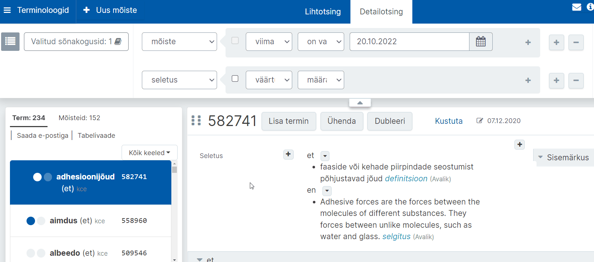
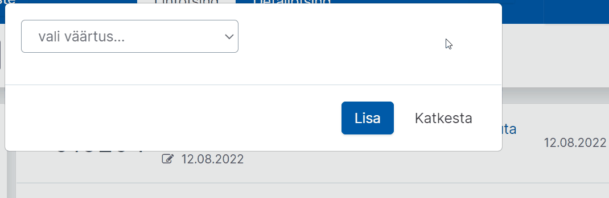
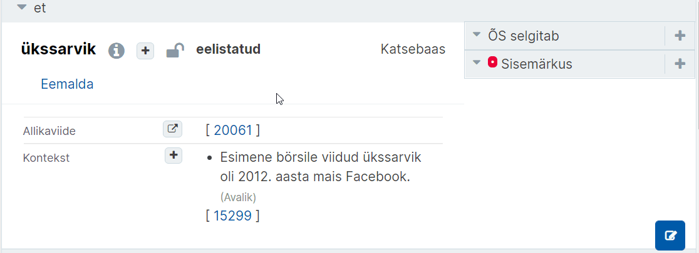
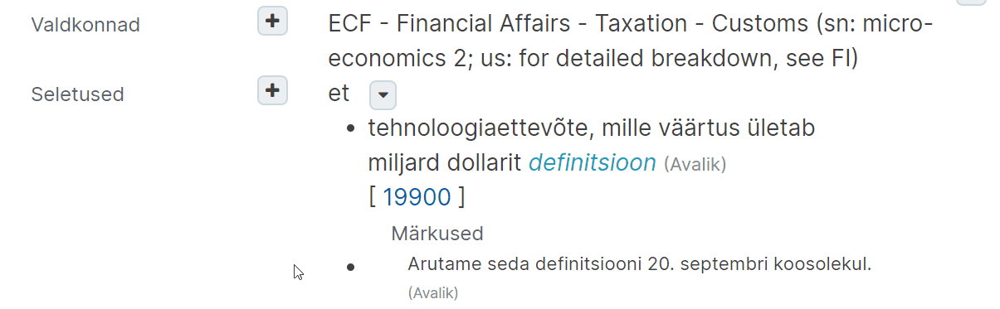

# Ekilexi kasutusjuhend

<button>[Avaleht](/index.md)</button>
<button>[Terminitöö sõnakoguga](/terminitoo.md)</button>

## Terminitöö sõnakoguga

### Sisukord
  - [Terminite otsing](#terminite-otsing-1)
    - [Otsingutulemustes kindlale lehele minemine](#otsingutulemustes-kindlale-lehele-minemine)
    - [Otsingutulemused tabelina](#otsingutulemused-tabelina)
    - [Detailotsingu tegemine](#detailotsingu-tegemine)
    - [Detailotsingu kriteeriumide peitmine](#detailotsingu-kriteeriumide-peitmine)
  - [Uus mõistekirje](#uus-mõistekirje)
    - [Mõiste ja Termini vahe](#mõiste-ja-termini-vahe)
      - [Mõiste ja termin Ekilexis](#mõiste-ja-termin-ekilexis)
    - [Uue mõistekirje loomine](#uue-mõistekirje-loomine)
    - [Mõiste definitsiooni vormijuhend](#mõiste-definitsiooni-vormijuhend)
      - [Üldine](#üldine)
      - [Vormistuslik pool](#vormistuslik-pool)
      - [Sisuline pool](#sisuline-pool)
    - [Definitsiooni lisamine](#definitsiooni-lisamine)
    - [Allikaviite lisamine mõistekirjes](#allikaviite-lisamine-mõistekirjes)
      - [Mitmele allikale toetuva definitsiooni allikaviide](#mitmele-allikale-toetuva-definitsiooni-allikaviide)
  - [Olemasolevasse mõistekirjesse lisamine](#olemasolevasse-mõistekirjesse-lisamine)
    - [Kirjesse märkuse lisamine](#kirjesse-märkuse-lisamine)
      - [Mõiste märkus](#mõiste-märkus)
      - [Definitsiooni märkus](#definitsiooni-märkus)
      - [Termini (ilmiku) märkus](#termini-ilmiku-märkus)
      - [Mitteavaliku sisemärkuse lisamine](#mitteavaliku-sisemärkuse-lisamine)
    - [Piltide lisamine tekstiväljadele](#piltide-lisamine-tekstiväljadele)
    - [Üla- või alaindeksi lisamine](#üla--või-alaindeksi-lisamine)
    - [Mõistete omavahelise seose näitamine](#mõistete-omavahelise-seose-näitamine)
    - [Termini usaldusväärsuse märkimine](#termini-usaldusväärsuse-märkimine)
    - [Näitamine, et termin on eelistatud, vananenud või välditav](#näitamine-et-termin-on-eelistatud-vananenud-või-välditav)
    - [Pisiparanduste tegemine ilma muutmiskuupäeva muutusteta](#pisiparanduste-tegemine-ilma-muutmiskuupäeva-muutusteta)
  - [Kirjete osiste mitteavalikuks muutmine](#kirjete-osiste-mitteavalikuks-muutmine)
    - [Termini avalikkuse muutmine](#termini-avalikkuse-muutmine)
    - [Definitsiooni, märkuse, kasutusnäite avalikkuse muutmine](#definitsiooni-märkuse-kasutusnäite-avalikkuse-muutmine)
  - [Mõistekirje dubleerimine](#mõistekirje-dubleerimine)
  - [Kõikide terminibaasi mõistekirjete korraga kuvamine](#kõikide-terminibaasi-mõistekirjete-korraga-kuvamine)
    - [Kõik terminibaasi kirjed korraga](#kõik-terminibaasi-kirjed-korraga)
    - [Ühe muutja kindlas ajavahemikus tehtud tööd](#ühe-muutja-kindlas-ajavahemikus-tehtud-tööd)
  
---

### Terminite otsing

1. Vajuta töölaual **„Terminoloogid“**.

2. Avaneb terminoloogi vaade. Vajuta nuppu **„Valitud sõnakogusid: 0“**. 
 
Pilt: Terminoloogide vaates sõnakogude valimine

3. Vali linnukestega sõnakogud, millest soovid otsida, ja vajuta **„Vali“**.
  
Pilt: Kindlate sõnakogude valimine

4. **Sisesta otsisõna**. Kasutada võib **metamärke**: 
    - **?** = 1 suvaline tähemärk (nt kui otsid „m?iste“ siis leiad nt „mõiste“, „muiste“);
    - **\*** = 0 või rohkem suvalisi tähemärke. (nt kui otsid „\*hiir\*“, siis leiad nii „hiir“, „arvutihiir“, „hiirehernes“ kui „aedhiirehernes“.)

5. Vajuta „Otsi“.

- Tulemuseks on nimekiri eri terminitest, millele klõpsates saab näha peamises aknas terminile vastavat mõistekirjet, ehk mõistet selle ID koodiga ning sellele järgnevalt kõiki termineid, otsitav kaasaarvatud.

Pilt: Otsingutulemus, vasakul küljepaneelis sõna sisaldavad terminid, peamises aknas mõistekirje ja selle osad. 

- Tulemusi saab sorteerida ka mõiste alusel, kusjuures seotud terminid on sel juhul näha kohe küljepaneelis. Muidu on mõistekirje vaade aga sama.

Pilt: Sama otsingutulemus, nüüd aga küljepaneel sorteeritud mõistete järgi.

#### Otsingutulemustes kindlale lehele minemine

Kui teete Ekilexis otsinguid, võib mõnikord tulla lehekülgede kaupa vastuseid. Et te ei peaks soovitud leheni jõudmiseks kõiki eelmisi lehti läbi vaatama, **võite lahtri “Mine lehele” järele sisestada selle lehenumbri, kuhu soovite suunduda**.

1.  **Lahter “Mine lehele” asub otsingutulemuste allosas.** Kui te seda kohe ei näe, püüdke leht alla kerida ning otsige lahtrit **lehe vasakul pool asuvate tulemuste alläärest**.

2.  Lehele suundumiseks **trükkige lahtrisse soovitud number** ning **vajutage klaviatuuril nuppu “Enter”**.
  
Pilt: Lehe all vasakul asuv lahter, kuhu saab lehe numbri sisestada

Allikas: [terminoloogia.ee](https://terminoloogia.ee/ufaqs/kuidas-minna-otsingutulemustes-kindlale-lehele/)

#### Otsingutulemused tabelina

Ekilexis saab mõistekirjete otsingutulemusi kuvada tabelina. See toimib **kuni 50 kirje puhul**. 
Et tabelivaadet näha, käituge järgmiselt.

1. Tehke soovitud otsing.

2. Vajutage otsingutulemuste ülaosas **nupule "Tabelivaade"**:
  
Pilt: Terminoloogide otsingus Tabelivaate avamine

3. Kui otsingutulemustes on kuni 50 kirjet, avaneb tabel eraldi vahelehel:
  
Pilt: Otsingu tulemused tabelivormis

4. Tabelivaates on näha seletused, kirjes olevad terminid ja kasutusnäited. Samuti kuvatakse iga osise avalikkus(tabaluku ikoon).

Allikas: [terminoloogia.ee](https://terminoloogia.ee/ufaqs/kuidas-naen-otsingutulemusi-tabelina/)

#### Detailotsingu tegemine

Lihtotsingu tegemisel on tulemusteks täpne vaste otsitule.   
On võimalik tulemusi laiendada ? ja * metamärkidega, aga palju täpsemaid või spetsiifilise mõistekirje osaga seotud otsinguid tuleb teha **Detailotsingus**.
  
Pilt: Detailotsingu vaikimisi seadistus

- Esimese lahtri "termin" alt rippmenüüst saab valida, millise võimaliku mõistekirje osa kohta otsing käib. Vaikimisi on terminivaates "termin".
- Märkeruut halli ala alguses, kui märgitud, muudab otsingu eitavaks/negatiivseks. Näiteks ülemise näite puhul selle märkimine teeks otsingu terminite kohta, mille väärtus **ei ole** sisestatud sõna.
- Teise lahtri "väärtus" alt rippmenüüst saab valida, millise mõistekirje osa elemendi kohta otsing käib.
- Kolmanda lahtri "on" alt rippmenüüst saab valida, milline suhe on järgnevalt sisestatud infol otsitava elemendiga.
- Neljanda lahtri tühi ala on tekstikast kuhu otsitav info kirjutada.
- Suure halli ala sees olev plussmärk annab võimaluse lisada sama mõistekirje osa otsingu kohta veel võrdselt kehtivaid parameetreid.
- Eraldiseisev plussmärk annab võimaluse samas otsingus kontrollida mitme mõistekirje elemendi  ?? lause kuidas?

**Näide:**

Kui teha alloleval pildil näidatud otsing, siis otsitakse mõisted, kus sisaldub **üks termin, mis vastab mõlemale tingimusele** (looja on Karol Kaljuste ja viimase muutmise aeg on hilisem kui 01.03.2023).

Pilt: Kirjeldatud otsing, punane ring ümber tekstikastile järgneva plussmärgi

Kui aga teha otsing nii, nagu näidatud alloleval pildil, siis otsitakse mõisteid, kus sisaldub ***üks termin*, mis vastab *esimesele* tingimusele** (looja on Karol Kaljuste) ja kus lisaks sisaldub ***teine termin*, mis vastab *teisele* tingimusele** (termini muutmise aeg on hilisem kui 01.03.2023).

Pilt: Kirjeldatud otsing, mõlemad tingimused on nüüd eraldi terminite järel, punane ring ümber alast väljas oleva plussmärgi

#### Detailotsingu kriteeriumide peitmine

Ekilexis on detailotsing, mis võimaldab terminibaasist kindlate kriteeriumide alusel kirjeid leida. Et aga otsing tulemusi sirvides liiga palju ruumi ja tähelepanu ei nõuaks, on võimalik otsingukriteeriumid selleks ajaks peitu klõpsata.

- **Kriteeriume saab peita otsingukastide all paikneva noolekesega**. Et otsing taas avada, tuleks uuesti noolekesele klõpsata.
  
Pilt: Detailotsingu peitmine

Allikas: [terminoloogia.ee](https://terminoloogia.ee/ufaqs/kuidas-peita-detailotsingu-kriteeriume/)

---

### Uus mõistekirje

#### Mõiste ja Termini vahe

**“Mõiste” ja “termin” ei ole sünonüümid.**

**Mõiste on teadmusüksus**, st ettekujutus mingist
objektist või nähtusest. Mõistet kirja panna ei saa.

**Termin on sõnaüksus**, st sõna või sõnaühend,
millega mõistet tähistatakse.

Mõiste ja termini suhet iseloomustab järgmine illustratsioon:
  
Pilt: Mõistet kirja panna ei saa, kuid seda tähistame **terminitega** ja kirjeldame **definitsiooni** kaudu.

##### Mõiste ja termin Ekilexis

Ekilexis on ühe mõiste kohta käiv teave (**sh terminid ja definitsioonid**) koondunud ühte **mõistekirjesse**.

  
Pilt: Terminoloogide kuva, üleval on eri definitsioonid, all üksteise järel terminid. Mõlemad need kokku on mõistekirje.

Allikas: [terminoloogia.ee](https://terminoloogia.ee/ufaqs/mis-on-moiste-ja-mis-on-termin/)

#### Uue mõistekirje loomine

Enne uue mõistekirje lisamist veenduge, et **Tegutsete Ekilexis õiges rollis** (enda terminibaasi muutja või omaniku rollis). Lugege lähemalt [Terminibaasis muudatuste tegemine](/index.md#terminibaasis-muudatuste-tegemine).

<!-- video on päris aegunud, teistsugune interface ja protsess... kas eemaldada ja teha uus?

Video: Mõistekirje loomine Ekilexis-->

1. Ava töölaual link "Terminoloogid"

2. Valige Terminoloogide vaates loetelust "Valitud sõnakogud" **kõik sõnakogud.** See on oluline, et süsteem oskaks lisatavat terminit teiste terminibaaside infoga võrrelda.
  
Pilt: Terminoloogide vaates sõnakogude valimine
    - Kõiki sõnakogusid aitab valida nupp **"Vali kõik"**.
  
Pilt: Sõnakogude valimisel saab vajutada nuppu "Vali kõik"

3. Vajuta sinisel navigeerimisribal **„Uus mõiste“**. Avaneb uue termini sisestusvorm. Seejärel
    1. sisesta termin (ehk keelend),
    2. selle all on kuvatud sõnakogu nimi, kuhu termin lisatakse,
    3. vali rippmenüüst keel,
    4. vajuta „Lisa termin“.
    
  Pilt: Termini lisamine

4. Kui sisestatud termin **ei esine** üheski olemasolevas sõnakogus, siis **luuakse uus termin ja mõiste** ning kuvatakse kogu info selle mõiste kohta terminoloogi otsingu vaates.

5. Kui sisestatud termin **juba esineb** olemasolevas sõnakogus, kuvab süsteem teile sama kujuga terminid ja nende kirjed, mis on teistesse sõnastikesse ja terminibaasidesse lisatud. **Tehke linnuke selle tähendusega termini ette, mis sarnaneb teie omaga enim**.
  
Pilt: Terminite valikust sobivaima valimine
    - Mõnikord võib juhtuda, et lehel toodud kirjetel puuduvad definitsioonid. Sel juhul näete kogu kirjet, kui klõpsate nupule **“Vaata tervet kirjet”**, et avada see uuel vahelehel.  
  Kui te ei leia sellelt lehelt ka pärast “Vaata tervet kirjet” nuppudel klõpsamist ühtegi sobivat tähendust, siis kirjutage aadressile kairi.janson@eki.ee.

6. Klõpsake sinisel nupul kirjaga **"Loo uus mõiste"**.  
Misjärel luuakse **uus termin ja mõiste** ning kuvatakse need. 

Allikas: [terminoloogia.ee](https://terminoloogia.ee/ufaqs/kuidas-lisada-ekilexi-uut-moistekirjet/)

#### Mõiste definitsiooni vormijuhend

Siinne juhend annab näpunäiteid nii definitsiooni **vormiliseks** kui ka **sisuliseks** koostamiseks.

Kuna Ekilexis töötavad koos paljud eri tegijad, on tähtis, et kõigi terminibaaside koostajad järgiksid **sarnast stiili**. Nii on suur ühisbaas ühtlasem. Seega oleks hea, kui ka terminibaaside koostajad lähtuksid definitsioonide koostamisel **ühest ja samast tavast**.

Näitena võime vaadata nt Ekilexi [ükssarviku kirje](https://ekilex.ee/termsearch/smode/SIMPLE/rmode/WORD/sfilt/%C3%BCkssarvik?id=509220) definitsiooni:
*noor, hrl vähem kui 10 aastat tegutsenud idufirma, mille turuväärtus on vähemalt miljard dollarit*

**Hea Definitsioon:**
- on lühike
- on täpne
- algab väikese tähega
- lõppeb punktita
- defineerib vaid ühte mõistet
- ei sisalda üleliigset infot
- ei korda defineeritava mõiste terminit
- sisaldab asjakohaseid termineid

##### Üldine

1. **Iga kirje defineerib ainult ühte mõistet**. Näiteks defineerime erinevalt joogi- ja kõnniteed. Niisiis peaks kummagi kohta olema koostatud eraldi kirje, kus asuks ainult seda konkreetset mõistet väljendav definitsioon.

2. **Kõik kirjes esinevad selgitamist vajavad mõisted on defineeritud omaette kirjetes**. Kui näiteks definitsioonis esineb mingi mõiste, mis vajaks lisaselgitust, peaks selle kohta koostama omaette kirje, mitte aga defineerima seda käsilolevas kirjes.

Näiteks esineb ükssarviku definitsioonis (*noor, hrl vähem kui 10 aastat tegutsenud idufirma, mille turuväärtus on vähemalt miljard dollarit*) termin “idufirma”. Idufirma kohta peaks koostama eraldi mõistekirje, kus see mõiste defineeritud oleks.

##### Vormistuslik pool

1. **Definitsioon peaks üldjuhul olema ühelauseline ja lõppema punktita.**
    - :heavy_check_mark: väljakujunenud idufirma, mille väärtus on vähemalt 1 miljard USA dollarit
    - :x: Väljakujunenud idufirma, mille väärtus on vähemalt 1 miljard USA dollarit.

2. **Lisainfoks sobib kasutada märkuse väljasid, mõnel juhul ka termini kasutusnäite välja. Definitsiooni märkus peaks olema lisatud definitsiooni märkuse väljale, mitte definitsiooniga samale väljale.**

3. **Definitsiooni alguses ei tohiks olla korratud defineeritavat terminit. Definitsiooni alguses ei tohiks olla kasutatud ka tegusõnu, nagu nt on, viitab, kirjeldab.**
    - :heavy_check_mark: väljakujunenud idufirma, mille väärtus on vähemalt 1 miljard USA dollarit
    - :x: ükssarvik on väljakujunenud idufirma, mille väärtus on vähemalt 1 miljard USA dollarit

4. **Definitsioon peaks olema esitatud ainsuses.**
    - :heavy_check_mark: väljakujunenud idufirma, mille väärtus on vähemalt 1 miljard USA dollarit
    - :x: väljakujunenud idufirmad, mille väärtus on vähemalt 1 miljard USA dollarit

5. **Definitsioonis ei tohiks olla kasutatud defineeritava mõiste kohta käivat terminit ega sünonüümi või lühendit.**  
Näide: **idufirma** (sünonüüm *startup*)
    - :heavy_check_mark: alles käivituv suure kasvupotentsiaali ja uudse äriideega väikeettevõte
    - :x: alles käivituv *startup*, millel on suur kasvupotentsiaal ja uudne äriidee

6. **Definitsioonis peaks olema kasutatud sama sõnaliiki kui termini puhul: tegusõna on defineeritud tegusõna või tegusõnafraasi abil, nimisõna nimisõna kaudu**  
Näide: **toitumine**
    - :heavy_check_mark: organismi varusta<ins>mine</ins> toitainetega
    - :x: toitained, millega organismi varustatakse

7. **Ühel definitsiooniväljal peaks olema ainult üks definitsioon.**  
Näide: **kardioloogia**
    - :heavy_check_mark: 1. välja definitsioon: meditsiinivaldkond, kus uuritakse südame- ja veresoonkonna ehitust ja talitlust ning kaasasündinud ja omandatud haigusi ning tegeldakse südamehaiguste ennetamise, diagnoosimise ja raviga  
    :heavy_check_mark: 2. välja definitsioon: meditsiinivaldkond, kus uuritakse, ennetatakse, diagnoositakse ning ravitakse südame- ja veresoonkonnahaigusi
    - :x: meditsiinivaldkond, kus uuritakse südame- ja veresoonkonna ehitust ja talitlust ning kaasasündinud ja omandatud haigusi ning tegeldakse südamehaiguste ennetamise, diagnoosimise ja raviga; meditsiinivaldkond, kus uuritakse, ennetatakse, diagnoositakse ning ravitakse südame- ja veresoonkonnahaigusi

##### Sisuline pool

1. **Definitsioon peaks olema selge ja ühemõtteline.**

2. **Definitsioonis peaks olema esitatud defineeritava olemasolevad, mitte puuduvad tunnused.**  
Näide: **lehtpuu**
    - :heavy_check_mark: heitlehine või igihaljas lehtedega puu
    - :x: puu, mis ei ole okaspuu

3. **Definitsioonis peaks olema toodud kõik olulised tunnused, mille poolest mõiste eristub naabermõistetest (lähedastest mõistetest)**  
Näite: **toomingas**
    - :heavy_check_mark: valgete lõhnavate õiekobarate ja mustade või punaste luuviljadega lehtpuu või -põõsas
    - :x: lehtpuu

Allikas: [terminoloogia.ee](https://terminoloogia.ee/ufaqs/milline-peaks-olema-moiste-definitsioon/)

#### Definitsiooni lisamine

Definitsiooni saab lisada mõistekirje ülaosast mõisteplokist.

1. Vajutage kas **plussile kirja “Seletused” juures** (nagu alloleval näitel) või **plussile paremal ülaosas**, valides sealt väärtuseks **“Mõiste seletus”**.
  
Pilt: Terminoloogia vaates Seletuse lisamine

2. Kopeerige või kirjutage soovitud definitsioon avanenud akna tekstiväljale.

3. Valige definitsiooni keel.

4. Valige definitsiooni tüüp (terminitöös enamasti “definitsioon”).
  
Pilt: Definitsiooni andmete lisamine

<!-- siia kirja mida need rõhk jms nupud kõik teevad ja mille jaoks need on, aga alles pärast 1.29 update'i? -->

Allikas: [terminoloogia.ee](https://terminoloogia.ee/ufaqs/kuidas-lisada-moistekirjesse-definitsiooni/)

#### Allikaviite lisamine mõistekirjes

Terminitöös on oluline viidata termini allikatele.  
Ekilexi saab salvestada allikakirjeid ja terminite juurest neile viidata. Ühe allika jaoks piisab Ekilexis ühest allikakirjest, millele saab viidata erinevatest sõnakogudest.  
Kui juhtumisi on loodud mitu allikakirjet samale allikale, saab neid ühendada kokku üheks allikakirjeks.

Ekilexi kontekstis nimetatakse allikakirjeid ka lühemalt lihtsalt **allikateks**. 

Allikakirjete otsimine, lisamine ja muutmine on kirjeldatud lähemalt siin: [Allikad](/allikad.md).

Kui allikas on loodud, siis saab mõistekirjes tekitada sellele erinevate väljade juures (nagu termin, märkus, definitsioon) **viiteid**. 

1. Varem lisatud definitsioonile/seletusele saab allikaviite lisada, vajutades hiirega selle peale liikudes ilmuva allikaviite lisamise nupule. 

Pilt: Seletuse teksti peale liikudes ilmub hall Allikaviite lisamise nupp, kastikese ja noole ikooniga

    1. Vajutades avaneb allikaviite otsing. Seal saab otsida kõikide allika atribuutide järgi, kaasa arvatud tema nime (SOURCE_NAME) järgi. <!-- kas seda kommentaari lõppu on vaja enam?? mdea mis source name täpselt on-->

    2. Allika otsimisel on kindlasti abiks tärn „\*“, sest selle abil saab leida osalisi vasteid. Nt otsides "int\*meteo\*" leitakse "INTERNATIONAL METEOROLOGICAL VOCABULARY", sest * asendab suvalist arvu märke. Kui nimesid on mitu, nagu selles näites, saab raadionupuga valida selle nime, mida hakatakse kuvama allikaviitena.

Pilt: Allika nimeosa sisestamine, õige leidmine ja selle kuvatava nime märgistamine

    3. Lahter „Siseviide“ on selle jaoks, kui peaks olema soov täpsustada asukohta selles allikas, nt „lk 69“ ja see kuvatakse allikaviite järel. Valiku kinnitamiseks vajutada nuppu "Vali"

Pilt: Siseviite lahtrisse info sisestamine ja allika valimine

2. Terminile saab allikaviite lisada halli „+“ nupuga, avades akna andmete lisamiseks. 
    1. Selle akna rippmenüüst tuleb valida "Allikaviide".
  
Pilt: Hallist nupust andmete lisamine, sealt valida "Allikaviide"

    3. Järgmises aknas saab alustada allika nime sisestamist, ning valida pakutute hulgast, seejärel sobiva esitusviisi märgistada ning klõpsata nuppu "Vali", et allikas lisada.
  
Pilt: Allika nime sisestamine, õige märgistamine ja valimine

##### Mitmele allikale toetuva definitsiooni allikaviide

Siia alla kuuluvad juhtumid, kus definitsioon ei pärine sõna-sõnalt konkreetsest allikast (raamat, leksikon, muu terminibaas vms), aga komisjon on
<ol type="a">
  <li>sealse definitsiooni aluseks võtnud ja selles muudatusi teinud;</li>
  <li>mitme allika põhjal ühe definitsiooni koostanud.</li>
</ol>

Sellistes olukordades tuleks definitsioonile lisada mitu allikaviidet: **üks komisjonile ja teine inspiratsiooniks olnud allikale**. Kui definitsioon on koostatud mitme eri allika põhjal, peaks **viitama neile kõigile**.

Kokkuleppe kohaselt paikneb **komisjoni allikaviide esimesel kohal, sellele järgnevad inspiratsiooniallika või -allikate viited (vt allolevat pilti)**. Kuna allikaviidete lisamisel läheb esimesele kohale viimasena lisatud viide, peaks viited lisama järgmises järjekorras:

1. **inspiratsiooniallikas** (või -allikad) + **„põhjal“** („põhjal“ siseviitena; nt„IATE põhjal“)
2. **komisjoni nimetus** (nt „EVTK“).

**Näide**

Oletame, et kuulun ettevõtlusterminite komisjoni, mille lühinimi on EVTK. Oleme komisjoniga leidnud, et Euroopa Liidu institutsioonide terminibaasis IATE on meile peaaegu sobiv ükssarviku definitsioon, aga soovime seda siiski pisut muuta. Sellisele definitsioonile peangi mõistekirjes seega märkima nii enda komisjoni kui ka IATE viited.

  
Pilt: Näide definitsioonist, mille aluseks on võetud IATE definitsioon, mida komisjon on seejärel kohaldanud. 

Nagu mainitud, peaks sõna „põhjal“ olema lisatud siseviite väljale. Siseviidet saab märkida mitte allikakirjet muutes, vaid mõistekirjes konkreetse kirje osise juures allikakirjele viidates.

  
Pilt: Näide sellest, kuidas lisada mõistekirjes allikakirjele viidates siseviite reale sõna “põhjal”

Allikas: [terminoloogia.ee](https://terminoloogia.ee/ufaqs/kuidas-teha-ekilexis-allikaviide-sellisele-definitsioonile-mille-komisjon-on-koostanud-kas-uhest-voi-mitmest-allikast-lahtudes/)

---

### Olemasolevasse mõistekirjesse lisamine

Terminibaasid on mõistepõhised, mis tähendab, et **ühes mõistekirjes on koos kõik sama mõiste kohta käivad terminid (sünonüümid), sh paralleelvariandid ning terminid teistes keeltes.**

Kui soovite juba **olemasolevasse kirjesse uut terminit lisada** (ükskõik, mis keeles), peaksite vajutama mõistekirje ülaosas nupule **“Lisa termin”**.  
Lisatav termin võib olla nii muukeelne vaste kui ka eesti- või muukeelne sünonüüm.
  
Pilt: Uue termini lisamine

**NB! Kindlasti ei tohiks sünonüüme või muid terminivariante kirjutada koos ühele ja samale terminiväljale.  
Terminiväljal ei tohiks olla komasid, semikooloneid, kaldkriipse või muid sümboleid, välja arvatud siis, kui need on termini enda osa.**

**Näide:**

Oletame, et tahan sünonüümidena terminibaasi kanda terminid **hõberemmelgas** ja **hõbepaju.**

1. Kui hakkan mõistekirjet alles looma, vajutan Ekilexis ülevalt siniselt ribalt nuppu “Uus mõiste”. Lisan termini *hõberemmelgas*. 

2. Kui mõistekirje on juba loodud ja soovin kirjesse lisada ka teise termini (sünonüümi), pean selle lisama uuele terminiväljale. **Selleks vajutan loodud kirjes nuppu “Lisa termin”**. Trükin avanenud väljale termini *hõbepaju* ja valin keeleks eesti.

Pilt: 
    - Muukeelse termini (vaste) lisamine käib samamoodi, ainult et eesti keele asemel tuleb avanenud aknas valida termini õige keel.

3. Lisatud terminid on nüüd esitatud eri terminiväljadel. Mõlemad terminid tulevad välja, kui neid Ekilexis või Sõnaveebis otsida.

Et leida oma terminibaasist termineid, mis võivad olla ühel väljal koma, semikooloni või mõne muu märgiga eraldatud, võiksite kasutada järgmist otsingut:
  
Pilt: Terminoloogide vaate detailotsing: termin; väärtus; sisaldab; soovitud märk

<>Allikas: [terminoloogia.ee](https://terminoloogia.ee/ufaqs/kuidas-lisada-uut-terminit/) ja [terminoloogia.ee](https://terminoloogia.ee/ufaqs/miks-on-oluline-et-iga-termin-oleks-kantud-eraldi-valjale/)

#### Kirjesse märkuse lisamine

Ekilexis saab mõistekirjesse lisada märkusi, millega saab mõiste, definitsiooni või termini kohta lisainfot anda. **Kuna mõiste definitsioon peaks olema ühelauseline, sobib märkuseväljale üldjuhul ka selline teave, mida tahaksite definitsiooni järele teiseks või kolmandaks lauseks lisada.**

Erinevalt definitsioonist võiksid märkused olla **vormistatud täislausetena, mis algavad suure tähega ja lõppevad punktiga**. Ühele märkuseväljale võib lisada mitu lauset. **Igal märkusel võiks olla ka allikaviide**: juhul kui tegu on allikast kopeeritud teabega, peaks viitama sellele allikale, kui aga märkuse on lisanud terminikomisjoni esindaja, peaks viitama komisjonile.

##### Mõiste märkus

Mõiste märkuse väljale sobib enamasti teave, mis ei kommenteeri konkreetset terminit või definitsiooni ega selle sõnastust. **Tegu on lisainfoga, mis annab teavet nähtuse (mõiste) kui sellise kohta.**  
(Kui mõiste ja termini erinevused on teile ebaselged, siis vaadake selle kohta lähemalt [siit](link sellele juhendis).)

1. Mõiste märkust saab lisada **plussmärgist**, mis asub **kirje kõige ülemises paremas nurgas**:
  
Pilt: Plussmärk kirje nurgas

2. Avanenud menüüst tuleks valida variant **“Märkus”**:
  
Pilt: Rippmenüüst variandi valimine

3. Seejärel avaneb tekstiväli, kuhu saate soovitud teksti sisestada.

##### Definitsiooni märkus

Definitsiooni märkuse väljale sobib enamasti teave, mis **kommenteerib definitsiooni või on sellega muul moel väga tihedalt seotud.**

1. Definitsiooni märkust saab lisada, kui **minna kursoriga definitsiooni teksti peale** ning **vajutada halli märkmepaberi nuppu**:
  
Pilt: Seletuse kõrval ilmuvad nupud, keskmine neist hall

2. Seejärel avaneb tekstiväli, kuhu saate soovitud teksti sisestada.

##### Termini (ilmiku) märkus

Termini märkuse väljale sobib teave, mis **kommenteerib terminit**. Sinna võib kanda näiteks lisainfot selle kohta, kes termini esimest korda kasutusele võttis. Kui sama mõiste kohta on aga näiteks kasutusel kaks paralleelterminit, võib termini märkuste abil täpsustada seda, mis ringkonnas emb-kumb termin kasutusel on (juhul kui selline erinevus on teada).

1. Termini märkust saab lisada **termini kõrval asuvast plussmärgist**:
  
Pilt: Termini paremal pool asub plussmärk
<!-- kui seda loeb screenreader siis ei anna see mingit lisa infot... peaks kuidagi ikka paremini kirjeldama??-->

2. Avanenud menüüst tuleks valida variant **“Ilmiku märkus”**:
  
Pilt: Rippmenüüst valida variant

3. Seejärel avaneb tekstiväli, kuhu saate soovitud teksti sisestada.

**Võimalik on lisada ka mitteavalikke märkusi**, mida väliskasutaja Sõnaveebis ei näe. Need tulevad kasuks siis, kui tegu on kommentaaridega, mis on mõeldud vaid terminibaasi koostajatele.

Allikas: [terminoloogia.ee](https://terminoloogia.ee/ufaqs/kuidas-lisada-kirjesse-markusi/)

##### Mitteavaliku sisemärkuse lisamine

Nii terminite kui ka mõisteploki (kirje ülemine osa, mis sisaldab definitsioone, seotud termineid ja valdkondi) juurde saab lisada sisemärkusi, mis ei muutu Sõnaveebis avalikuks. Sisemärkustesse saab kirjutada teavet, mis on oluline vaid komisjonile endale.

1. **Sisemärkuse nupp** asub terminite või mõisteploki juures paremal pool (kirja “ÕS selgitab” juures).
 
Pilt: Sisemärkuse "+" nupu asukoht

2. Avanevasse tekstiaknasse saab trükkida sisemärkuse. Sisemärkuse lisamiseks tuleb vajutada nuppu **“Lisa”**.
  
Pilt: Sisemärkuse lisamine

3. Sisemärkuse olemasolu kirjes näitab selle nupu juures olev **punane täpike**. Kui täpikese kõrval olevale **noolele klõpsata**, saab sisemärkust näha. Uuesti klõpsates saab sisemärkuse sulgeda.
  
Pilt: Sisemärkuse olemasolu ja selle avamine

4. **Terminoloogide vaate detailotsingust on võimalik üles leida kirjed, kuhu olete sisemärkuse lisanud**. Selleks tuleb minna detailotsingusse ja teha järgmised valikud.  
**NB!** Esimesest tulbast peab olema valitud “termin” juhul, kui tahate leida termini juurde lisatud sisemärkusi. Kui lisasite sisemärkuse kõige üles, st mõisteplokki (definitsioonide juurde), leiate sellised kirjed üles, kui valite otsingus esimesest rippmenüüst “Mõiste”.
  
Pilt: Detailotsingu kasutamine sisemärkusega terminite otsimiseks

Ekilexis saab mitteavalikuks muuta ka neid välju, mis on muidu avalikud (termin koos selle juures oleva teabega, definitsioon, kasutusnäide jm).

Allikas: [terminoloogia.ee](https://terminoloogia.ee/ufaqs/kuidas-lisada-moistekirjesse-mitteavalikku-sisemarkust/)

#### Piltide lisamine tekstiväljadele

(Hetkel mittefunktsionaalne 01.04.2023)

**Mõistekirje tekstiväljadele** (definitsioon, märkus, kontekst jm) **saab lisada pilte**. Need võimaldavad kirja panna erisümboleid sisaldavaid valemeid ja muud teavet, mida on tavapäraste tekstitööriistade abil keerukas sisestada.

1. Selleks, et valemeid lisada, **peaks pilt olema varem internetti üles laadidud**.

2. Pildi lisamiseks tuleb soovitud tekstivälja kastis vajutada sinist pildi lisamise nuppu. Seejärel tuleb kleepida aadressiväljale pildi avalik aadress. Kui kasutate näiteks pilveteenust, peab veenduma, et kopeeriksite just pildi avaliku jagamise aadressi.
  
Pilt: Pildi lisamise nupp, aadressi kleepimine ja lisamine

Allikas: [terminoloogia.ee](https://terminoloogia.ee/ufaqs/kuidas-lisada-moistekirjesse-erisumbolitega-valemeid/)

#### Üla- või alaindeksi lisamine

Ekilexis saab ala- ja ülaindekseid lisada nupu **„Lisa märgendus“** alt. Üla- ja alaindekseid saab lisada kõigile tekstiväljadele, kuhu on võimalik ise infot kirjutada: termin, definitsioon, kasutusnäide, märkus.

1. Kõigepealt peaksite minema hiirega soovitud välja peale, millele indeksit lisada soovite (nt termin). Peaksite vajutama **tekkinud sinisele muutmisnupule.**
  
Pilt: Liikudes termini tekstile tekib muutmisnupp

2. Seejärel peaksite **valima (märgistama) selle osa, mida üla- või alakirja panna soovite**.
  
Pilt: Tekstikastis tulevase alaindeksi märgistamine sinisega

3. Pärast seda peaksite vajutama kas **"ülaindeks"** või **"alaindeks"** nupule tööriistaribal.
  
Pilt: Sobiva indeksi valimine

5. Seejärel peaksite vajutama **„Salvesta“.**
  
Pilt: Salvesta nupu vajutus

Siis ilmub soovitud üla- või alaindeks kirjesse.
  
Pilt: Indeksiga termin

Allikas: [terminoloogia.ee](https://terminoloogia.ee/ufaqs/kuidas-lisada-ekilexis-ula-voi-alaindeksit/)

#### Mõistete omavahelise seose näitamine

Enamasti on ühes valdkonnas mõisted omavahel ühel või teisel moel seotud. Näiteks võib olla, et üks mõiste on üldisem (nt *tool*) ja hõlmab teist (nt *tugitool*). Ekilexis saate neid seoseid näidata.

Et Ekilexis kirjetevahelisi seoseid luua, saate kasutada **tähenduse seose funktsiooni**. Kahe kirje vahel saab märkida nii täpsemaid seoseliike (nt ülem- või alammõiste või antonüüm) kui ka üldist seost (tähenduse seos), seoseliiki täpsustamata.   
Kui mõiste on seotud mitme teise mõistega, saab luua ka mitu tähenduse seost.

**NB! Seoseid saab luua vaid enda terminibaasi kirjete vahel.** St kui soovite näiteks näidata, et mõiste ükssarvik on seotud mõistega idufirma, peate olema nende mõlema kohta oma terminibaasi kirjed loonud.

1. **Klõpsake mõisteplokis** (st kõige ülemises plokis, kus paiknevad ka seletused) **paremal asuva plussmärgi peale**.
  
Pilt: Mõisteplokis paremal hall plussmärk

2. Valige avaneva akna rippmenüüst **“Tähenduse seos”**. 
  
Pilt: Rippmenüüst valik

3. Otsige termini järgi seotud kirjet ja looge sellega seos järgmiselt.
    1. **Trükkige avanevas aknas esimesele väljale termin, mille kirjega soovite seost luua, ja vajutage “Otsi”**. Alumises näites paiknen ise kirjes ükssarvik ja soovin luua seost kirjega idufirma.
    2. **Valige rippmenüüst “Vali väärtus” soovitud seoseliik**. Näites valin üldise seoseliigi: “seotud (tähendus/mõiste)”.  
    **NB!** Vältige seoseid, mille järel on kirjas “kakskeelses” ja “võrdle”. Need on EKI leksikograafide töövahendid.
    3. **Tehke linnuke leitud (sobiva) kirje juurde**. Juhul kui vastuseks tuleb mitu mõistekirjet, veenduge, et teete linnukese enda terminibaasi kirje juurde (termini kõrval väikses kirjas on teie terminibaasi lühikood, näites “kce”, mis tähistab Katsebaasi).
    4. **Vajutage “Lisa valitud seosed”**.
      
    Pilt: Otsida keelend, valida seos, märkida valitav kirje

4. **Nüüd näete, et mõisteplokis on lisatud seos näha.** Kui klõpsate sinisel kirjal, jõuate seotud mõistekirjesse. Seosed on teie kirje juures näha ka Sõnaveebis.
  
Pilt: Tähenduse seos on pildil märgitud punase kastiga

Allikas: [terminoloogia.ee](https://terminoloogia.ee/ufaqs/kuidas-luua-moiste-seost/)

#### Termini usaldusväärsuse märkimine

Ekilex võimaldab märkida termini juurde selle usaldusväärsust. **Usaldusväärsust märkides saab osutada näiteks sellele, kui kindel on komisjon selles, et lisatud termin on sobilik või tegelikult kasutusel.** Kui termin on leitud näiteks vaid ühest (küsitavast) allikast, ent ei tundu esinevat mujal, võib selle juurde märkida madalama usaldusväärsushinnangu kui laiemalt levinud või komisjoni kinnitatud terminitele.

**Usaldusväärsushinnanguid on viis** (0 – madalaim, 5 – kõrgeim). Teha saab ka valiku “määramata”.

1. Usaldusväärsushinnangut saab lisada termini kõrval olevast **plussmärgist**.
  
Pilt: Termini kõrval asuv hall plussmärk

2. Rippmenüüst tuleks valida “**Ilmiku usaldusväärsus**” ning seejärel **numbrite seast valik teha**. Kinnitada valik nupuga "Lisa".
  
Pilt: Rippmenüüst valik, järgmisel real valida väärtus

3. Termini usaldusväärsushinnangut kuvatakse Ekilexis **tähekestega**.
  
Pilt: Ilmiku all rida 5 tähekesega

Allikas: [terminoloogia.ee](https://terminoloogia.ee/ufaqs/kuidas-markida-termini-usaldusvaarsust/)

#### Näitamine, et termin on eelistatud, vananenud või välditav

Terminibaasid on mõistepõhised, mis tähendab, et **ühes mõistekirjes on koos kõik sama mõiste kohta käivad terminid (sünonüümid), sh paralleelvariandid ning terminid teistes keeltes**.

Mõnikord võib aga näiteks üks termin olla eelistatum kui teine või soovite näidata, et termin oli kasutusel küll varem, aga on nüüdseks vananenud. Sellisel juhul tuleb terminile märkida **väärtusolek**.

1. Liikuge termini juurde ja **vajutage selle kõrval olevat plussmärki**
  
Pilt: Termini kõrval olev hall plussmärk

2. Valige avanenud menüüst **“Väärtusolek”**
  
Pilt: Rippmenüüst valik

3. Valige soovitud väärtusolek ja vajutage **“Lisa”**.
  
Pilt: Rippmenüüst valik

4. Nüüd on termini juures väärtusolek näha!
  
Pilt: Termini kõrval kirjas väärtusolek

Allikas: [terminoloogia.ee](https://terminoloogia.ee/ufaqs/kuidas-naidata-et-moni-termin-on-eelistatud-vananenud-voi-valditav/)

#### Pisiparanduste tegemine ilma muutmiskuupäeva muutusteta

Pisiparanduste funktsioon võimaldab teha “kirurgilisi” muudatusi ilma, et mõistekirje muutmiskuupäev muutuks. Pisiparanduste funktsiooni ei pea kasutama, kuid mõnikord võib see olla kasulik.
Näiteks kui teil ei ole aega tervet kirjet üle vaadata ja sellesse süveneda, siis ei ole mõistlik, et ka kirje muutmise kuupäev muutuks – kasutaja eeldab, et siis olete kogu kirje sel ajal üle vaadanud ja ajakohastanud.

- Pisiparanduste tegemise funktsiooni saab sisse ja välja lülitada **kirje allosas paremal pool asuvast sinisest nupust**.
  
Pilt: Pisiparanduste funktsiooni sisse lülitamine

Allikas: [terminoloogia.ee](https://terminoloogia.ee/ufaqs/kuidas-teha-kirjesse-pisiparandusi/)

---

### Kirjete osiste mitteavalikuks muutmine

Ekilexis on mõistekirje iga tekstivälja juures võimalik valida selle avalikkust. Vaikimisi on kõik väljad avalikud – see tähendab, et neid välju näeb ka iga väliskasutaja(Sõnaveebis).

Mõnikord aga võib juhtuda, et soovite mõistekirjesse lisada teavet iseenda ja teiste oma terminibaasi koostajate jaoks ega soovi, et kümned tuhanded väliskasutajad seda näeksid. Samuti võite soovida mitteavalikuks muuta osiseid, mida tahate veel muuta või täiendada.

Siiski pidage meeles: mittetäielik teave on kasutaja jaoks väärtuslikum kui teabe puudumine. Seepärast **soovitame üldjuhul hoida kõik kirje osised avalikud** – kui just need ei ole mõeldud sisekommentaaridena terminibaasi koostajatele endile.

#### Termini avalikkuse muutmine

Termini ja sellega seotud teabe avalikkusest annab märku termini juures olev **tabaluku märk**. Avatud tabalukk näitab, et termin koos teabega on **avalik**, suletud tabalukk aga näitab, et termin **ei ole avalikus keeleportaalis nähtav**.

1. Termini avalikkust saab muuta, kui **tabaluku ikoonil klõpsata**:
  
Pilt: termini avalikkuse muutmine tabaluku ikooni alt

Kui märgite termini mitteavalikuks, muutub mitteavalikuks ka muu selle juures olev info (kasutusnäide, allikaviide jm). **Kui mõistekirjes on kõik terminid märgitud mitteavalikuks, on väliskasutaja eest peidus kogu kirje**. 

2. Hiljem saate termini samale ikoonile klõpsates taas avalikustada. 

#### Definitsiooni, märkuse, kasutusnäite avalikkuse muutmine

Teiste tekstiväljade avalikkust saab muuta kas neid lisades või muutes. **Selleks peab eemaldama linnukese kirja “Avalik” eest**. 
1. Näiteks kui soovin mitteavalikuks muuta definitsiooni märkust, vajutan esmalt **definitsiooni muutmisnuppu**:
  
Pilt: Hiirega peale liikudes definitsiooni lõpus ilmuv sinine muutmisnupp

2. Seejärel **eemaldan avanenud aknas linnukese välja “Avalik” eest** ja **vajutan “Salvesta”**:
  
Pilt: Muutmisaknas "Avalik" eest linnukese eemaldamine ja Salvestamine

**NB!** Kui muudate mingi välja mitteavalikuks ajutiselt, siis **ärge unustage seda hiljem taas avalikustada**.

Allikas: [terminoloogia.ee](https://terminoloogia.ee/ufaqs/kuidas-saan-kirjete-osiseid-mitteavalikuks-muuta/)

---

### Mõistekirje dubleerimine
Mõistekirje dubleerimise funktsioon võib mõnikord kasuks tulla näiteks juhul, kui ühte kirjesse on kogemata lisatud kahe mõiste info ja soovite ühest kirjest teha kaks erinevat.

- **Mõiste dubleerimise nupp** asub kirje ülaosas nuppude “Lisa termin” ja “Ühenda” kõrval.
  
Pilt: Dubleerimise nupp kirje ülaosas

**Kui mõiste on dubleeritud, ilmub duplikaat automaatselt eelmise mõistekirje kõrvale, kuid on sellegipoolest teine kirje**.  
Ühes kirjes tehtavad muudatused kajastuvad vaid selles kirjes ega kandu automaatselt teise kirjesse: sisuliselt ongi tegu kahe eraldiseisva kirjega, milles on lihtsalt samasugune info.

Allikas: [terminoloogia.ee](https://terminoloogia.ee/ufaqs/kuidas-moistekirjet-dubleerida//)

---

### Kõikide terminibaasi mõistekirjete korraga kuvamine

Kõigepealt kirjeldame, kuidas saate näha kõiki oma terminibaasi kirjeid korraga.

Seejärel kirjeldame, kuidas saate näha kirjeid, mida just teie olete kindlas ajavahemikus muutnud.

#### Kõik terminibaasi kirjed korraga

Kõiki mõistekirjeid korraga näeb siis, kui:

1. minna terminoloogide otsingusse,
2. siniselt ribalt valida detailotsing,
3. **veenduda, et „Valitud sõnakogude“ alt on valitud soovitud terminibaas**;
4. esimesest rippmenüüst valida „mõiste“,
5. teisest rippmenüüst valida „muutmise aeg“,
6. kolmandast rippmenüüst valida „on varasem kui“,
7. neljandast rippmenüüst valida homne kuupäev.
  
Pilt: Näide terminoloogide detailotsingust

#### Ühe muutja kindlas ajavahemikus tehtud tööd

Kui soovite näha neid kirjeid, mida just **teie** olete kindlas ajavahemikus muutnud (või mille lisanud), peaksite **lisama otsingukriteeriumiks ka muutja**. See otsing annab kõige täpsema tulemuse just teie tehtud muudatuste kohta, kuna teie terminibaasides teevad tehnilisi muudatusi ka EKI leksikograafid ja terminoloogid.

1. Kõigepealt peaksite detailotsingust valima **soovitud ajavahemiku**, nt “on hilisem kui” “1.11.2022”: kõik kirjed, mida olete muutnud pärast 1. novembrit 2022.
  
Pilt: Näide terminoloogide detailotsingust

2. Seejärel peaksite lisama olemasolevale otsingule veel ühe otsivälja, **klõpsates otsikasti kõrval halli taustaga alal plussmärgile** (vasakpoolne plussmärk).
  
Pilt: Detailotsingu välja lõpus olev hall plussmärk

3. Lisatud otsiväljal võiksite teha järgmised valikud:
    1. „looja/muutja“,
    2. „on“,
    3. *trükkida enda nimi*.
  
Pilt: Detailotsingus lisatud real teistsugused valikud ja sisestatud nimi

Allikas: [terminoloogia.ee](https://terminoloogia.ee/ufaqs/kuidas-naen-koiki-oma-terminibaasi-moistekirjeid-korraga/)

