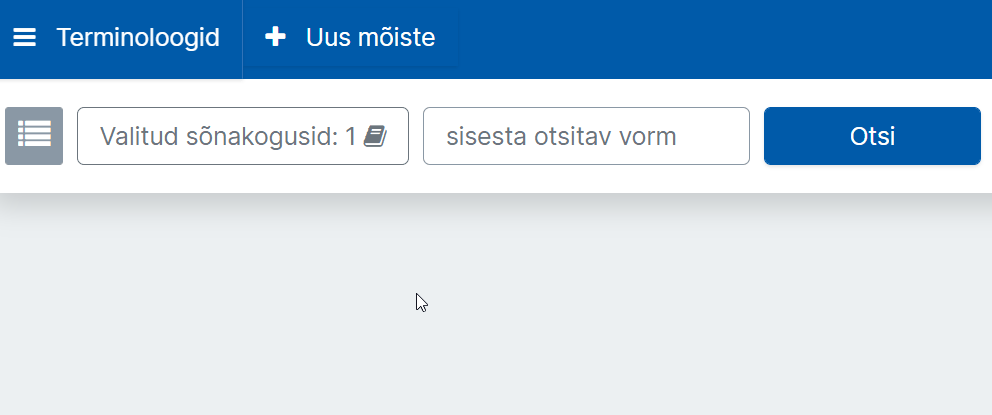
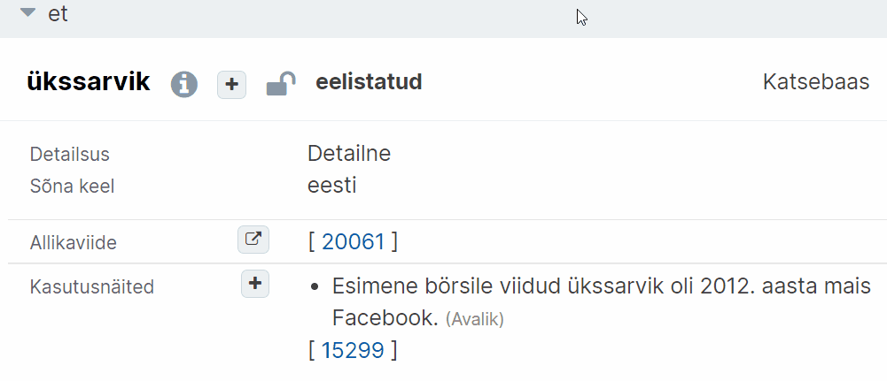

# Ekilexi kasutusjuhend

<button>[Avaleht](/index.md)</button>
<button>[Terminitöö sõnakoguga](/terminitoo.md)</button>

## Terminitöö sõnakoguga

### Sisukord
- [Terminite otsing](#terminite-otsing)
    + [Otsingutulemustes kindlale lehele minemine](#otsingutulemustes-kindlale-lehele-minemine)
    + [Otsingutulemused tabelina](#otsingutulemused-tabelina)
    + [Detailotsingu tegemine](#detailotsingu-tegemine)
    + [Detailotsingu võimalused](#detailotsingu-võimalused)
    + [Detailotsingu kriteeriumide peitmine](#detailotsingu-kriteeriumide-peitmine)
    + [Jäljemenüü](#jäljemenüü)
- [Uus mõistekirje](#uus-mõistekirje)
    + [Mõiste ja Termini vahe](#mõiste-ja-termini-vahe)
        - [Mõiste ja termin Ekilexis](#mõiste-ja-termin-ekilexis)
    + [Uue mõistekirje loomine](#uue-mõistekirje-loomine)
    + [Mõiste definitsiooni vormijuhend](#mõiste-definitsiooni-vormijuhend)
        - [Üldine](#üldine)
        - [Vormistuslik pool](#vormistuslik-pool)
        - [Sisuline pool](#sisuline-pool)
    + [Definitsiooni lisamine](#definitsiooni-lisamine)
    + [Allikaviite lisamine mõistekirjes](#allikaviite-lisamine-mõistekirjes)
        - [Mitmele allikale toetuva definitsiooni allikaviide](#mitmele-allikale-toetuva-definitsiooni-allikaviide)
- [Olemasolevasse mõistekirjesse lisamine](#olemasolevasse-mõistekirjesse-lisamine)
    + [Kirjesse märkuse lisamine](#kirjesse-märkuse-lisamine)
        - [Mõiste märkus](#mõiste-märkus)
        - [Definitsiooni märkus](#definitsiooni-märkus)
        - [Termini (ilmiku) märkus](#termini-ilmiku-märkus)
        - [Mitteavaliku sisemärkuse lisamine](#mitteavaliku-sisemärkuse-lisamine)
    + [Piltide lisamine tekstiväljadele](#piltide-lisamine-tekstiväljadele)
    + [Üla- või alaindeksi lisamine](#üla--või-alaindeksi-lisamine)
    + [Mõistete omavahelise seose näitamine](#mõistete-omavahelise-seose-näitamine)
    + [Termini usaldusväärsuse märkimine](#termini-usaldusväärsuse-märkimine)
    + [Näitamine, et termin on eelistatud, vananenud või välditav](#näitamine-et-termin-on-eelistatud-vananenud-või-välditav)
    + [Pisiparanduste tegemine ilma muutmiskuupäeva muutusteta](#pisiparanduste-tegemine-ilma-muutmiskuupäeva-muutusteta)
- [Kirjete osiste mitteavalikuks muutmine](#kirjete-osiste-mitteavalikuks-muutmine)
    + [Termini avalikkuse muutmine](#termini-avalikkuse-muutmine)
    + [Definitsiooni, märkuse, kasutusnäite avalikkuse muutmine](#definitsiooni-märkuse-kasutusnäite-avalikkuse-muutmine)
- [Mõistekirje dubleerimine](#mõistekirje-dubleerimine)
- [Kõikide terminibaasi mõistekirjete korraga kuvamine](#kõikide-terminibaasi-mõistekirjete-korraga-kuvamine)
    + [Kõik terminibaasi kirjed korraga](#kõik-terminibaasi-kirjed-korraga)
    + [Ühe muutja kindlas ajavahemikus tehtud tööd](#ühe-muutja-kindlas-ajavahemikus-tehtud-tööd)
  
---

### Terminite otsing

1. Vajutage töölaual **"Terminoloogid"**.

2. Avaneb terminoloogi vaade. Vajutage nuppu **"Valitud sõnakogusid: 0"**.  
  
    Pilt: Terminoloogide vaates sõnakogude valimine

3. Valige linnukestega sõnakogud, millest soovite otsida, ja vajutage **"Vali"**.  
  
    Pilt: Kindlate sõnakogude valimine  
    - *Märkus: soovitame terminitööd tehes [valida kõik sõnakogud](#uue-mõistekirje-loomine), et olla kursis kõigi seotud terminitega.*

4. **Sisestage otsisõna**. Kasutada võite **metamärke**: 
    - **?** = 1 suvaline tähemärk (nt kui otsite "m?iste" siis leiate nt "mõiste", "muiste");
    - **\*** = 0 või rohkem suvalisi tähemärke. (nt kui otsite "\*hiir\*", siis leiate nii "hiir", "arvutihiir", "hiirehernes" kui "aedhiirehernes".)

5. Vajutage **"Otsi"**.

- Tulemuseks on nimekiri eri terminitest, millele klõpsates saate näha peamises aknas terminile vastavat mõistekirjet, ehk mõistet selle ID koodiga ning sellele järgnevalt kõiki termineid, otsitav kaasaarvatud.  
  
    Pilt: Otsingutulemus, vasakul küljepaneelis sõna sisaldavad terminid, peamises aknas mõistekirje ja selle osad 

- Tulemusi saate sorteerida ka mõiste alusel, kusjuures seotud terminid on sel juhul näha kohe küljepaneelis. Muidu on mõistekirje vaade aga sama.  
  
    Pilt: Sama otsingutulemus, nüüd aga küljepaneel sorteeritud mõistete järgi

---

#### Otsingutulemustes kindlale lehele minemine

Kui teete Ekilexis otsinguid, võib mõnikord tulla lehekülgede kaupa vastuseid. Et te ei peaks soovitud leheni jõudmiseks kõiki eelmisi lehti läbi vaatama, võite lahtri **"Mine lehele"** järele sisestada selle lehenumbri, kuhu soovite suunduda.

1.  Lahter **"Mine lehele"** asub otsingutulemuste allosas. Kui te seda kohe ei näe, püüdke leht alla kerida ning otsige lahtrit lehe vasakul pool asuvate tulemuste alläärest.

2.  Lehele suundumiseks trükkige lahtrisse soovitud number ning **vajutage klaviatuuril nuppu "Enter"**.  
  
    Pilt: Lehe all vasakul asuv lahter, kuhu saab lehe numbri sisestada

*Allikas: <a href="https://terminoloogia.ee/ufaqs/kuidas-minna-otsingutulemustes-kindlale-lehele/" target="_blank">terminoloogia.ee</a>*

---

#### Otsingutulemused tabelina

Ekilexis saab terminoloogide vaates mõistekirjete otsingutulemusi kuvada tabelina. See toimib **kuni 50 kirje puhul**. Leksikograafide vaates ei ole see võimalik.  
Et tabelivaadet näha, käituge järgmiselt:

1. Tehke soovitud otsing.

2. Vajutage otsingutulemuste ülaosas nupule **"Tabelivaade"**:  
  
    Pilt: Terminoloogide otsingus Tabelivaate avamine

3. Kui otsingutulemustes on kuni 50 kirjet, avaneb tabel eraldi vahelehel:  
   
    Pilt: Otsingu tulemused tabelivormis

4. Tabelivaates on näha **seletused**, kirjes olevad **terminid** ja **kasutusnäited**. Samuti kuvatakse iga osise avalikkus(tabaluku ikoon).

*Allikas: <a href="https://terminoloogia.ee/ufaqs/kuidas-naen-otsingutulemusi-tabelina/" target="_blank">terminoloogia.ee</a>*

---

#### Detailotsingu tegemine

**Lihtotsingu** tegemisel on tulemusteks täpne vaste otsingule.   
On võimalik tulemusi laiendada "?" ja "\*" metamärkidega, aga palju täpsemaid või spetsiifilise mõistekirje osaga seotud otsinguid tuleb teha **Detailotsingus**.  
   
    Pilt: Detailotsingu vaikimisi seadistus

- Esimese lahtri "termin" alt rippmenüüst saate valida, millise võimaliku mõistekirje osa kohta otsing käib. Vaikimisi on terminivaates "termin".
- Märkeruut halli ala alguses, kui märgitud, muudab otsingu eitavaks/negatiivseks. Näiteks ülemise näite puhul selle märkimine teeks otsingu terminite kohta, mille väärtus **ei ole** sisestatud sõna.
- Teise lahtri "väärtus" alt rippmenüüst saate valida, millise mõistekirje osa elemendi kohta otsing käib.
- Kolmanda lahtri "on" alt rippmenüüst saate valida, milline suhe on järgnevalt sisestatud infol otsitava elemendiga.
- Neljanda lahtri tühi ala on tekstikast kuhu otsitav info kirjutada.
- Suure halli ala sees olev "+" annab võimaluse lisada sama mõistekirje osa otsingu kohta veel võrdselt kehtivaid parameetreid.
- Eraldiseisev plussmärk annab võimaluse samas otsingus leida mitme erineva tingimusega termineid ?? lause kuidas?? ma ei saa vist täielikult aru sellest et seda kirjeldada :/
<!--lause parandada!-->

**Näide:**

Kui teha alloleval pildil näidatud otsing, siis otsitakse mõisted, kus sisaldub **üks termin, mis vastab mõlemale tingimusele** (looja on Karol Kaljuste ja viimase muutmise aeg on hilisem kui 01.03.2023).  
  
    Pilt: Kirjeldatud otsing, punane ring ümber tekstikastile järgneva plussmärgi

Kui aga teha otsing nii, nagu näidatud alloleval pildil, siis otsitakse mõisteid, kus sisaldub ***üks termin*, mis vastab *esimesele* tingimusele** (looja on Karol Kaljuste) ja kus lisaks sisaldub ***teine termin*, mis vastab *teisele* tingimusele** (termini muutmise aeg on hilisem kui 01.03.2023).  
  
    Pilt: Kirjeldatud otsing, mõlemad tingimused on nüüd eraldi terminite järel, punane ring ümber alast väljas oleva plussmärgi

---

#### Detailotsingu võimalused

1. **Otsida saab sildi järgi.** Näiteks saate enda terminibaasist üles leida kõik sellised terminid, mille olete märkinud sildiga "koostamisel" või "läbi vaatamata". Nii saate välja filtreerida need kirjed, mis vajavad veel tööd. Kui soovite leida kirjeid vaid enda terminibaasist, siis veenduge, et olete otsinguväljast vasakul valitud sõnakogude alt märkinud ainult enda terminibaasi.

    - **Et siltide järgi otsida saaks, peab terminitele silt ka lisatud olema**. Silte saab külge panna mõistekirjes, kui suundute termini juurde ja vajutate halli plussi, rippmenüüst valite "ilmiku silt" ja järgmisest menüüst sobiv silt.
  
    Pilt: Sildi lisamine terminile

    - **Saate otsida eri kirjeid selle järgi, millal silti muudeti**. Kui tahaksin saada loetelu nendest terminitest, millele on minu sõnakogus viimase kuu jooksul silt lisatud, peaksin valima "silt" → "muutmise aeg" → "on hilisem kui" → ja valima kalendrist kuu taguse kuupäeva.

2. **Otsida saab mõiste muutmisaja järgi**. Kui tahate otsida üles need kirjed, mida teie või mõni teine teie baasi koostaja viimase kuu aja jooksul muutnud on, peaksite valima "mõiste" → "muutmise aeg" → "on hilisem kui" → ja valima kalendrist kuu aja taguse kuupäeva. Ka siin peaks veenduma, et valitud on vaid enda sõnakogu.

3. **Lisaks allika viitele saab otsida ka allika id-koodi järgi**.
    - Allikale saate mõistekirjes viidata kõigi nende nimetustega, mis on allikakirjes kas allika nimetuse või lühinime väljal. Kombeks on allikakirjesse panna täispikk nimi ja lühend, näiteks allika nimetuse väljale "International Glossary of Hydrology" ja lühinime väljale "IGH". Mõistekirjes – näiteks definitsiooni või termini juures – viidatakse peamiselt lühendiga, sest see võtab vähem ruumi. Seetõttu võib aga juhtuda, et allika viite järgi otsides ei tule vasteks kõiki neid kirjeid, kus sellele allikale viidatud on. Leiab vaid kirjed, kus allikale on viidatud **sellel kujul, mis on otsinguväljale trükitud**. Kui olete valinud sõnakoguks katsebaasi ja otsite allika viite järgi "International Glossary of Hydrology’t", ei tule ühtegi vastet. Kui aga trükite otsingusse "IGH", tuleb vasteks "pais". Seda seepärast, et selles kirjes on viitamiseks kasutatud vormi "IGH".

    - **Allika id-koodi järgi otsides saate leida aga kõik kirjed, kus allikale ükskõik mis nimetusega viidatud on**. Id-kood on iga allikakirje unikaalne numbrikombinatsioon, mida näeb allikakirje ülaosas. Näiteks on "International Glossary of Hydrology" ehk "IGH" allikakirje id-kood 13544. Nii saate hea ülevaate sellest, kui palju terminibaasis kindlast allikast lähtutud on.

Et allika id-koodi järgi otsida, peab detailotsingust valima "miski" → "allika id kood" → "on" → ja trükkima või kleepima soovitud allikakirje koodi.

*Allikas: <a href="https://terminoloogia.ee/2020/12/15/ekilexi-uusimad-voimalused-taienenud-detailotsingud-ja-muu/" target="_blank">terminoloogia.ee</a>*

---

#### Detailotsingu kriteeriumide peitmine

Ekilexis on detailotsing, mis võimaldab terminibaasist kindlate kriteeriumide alusel kirjeid leida. Et aga otsing tulemusi sirvides liiga palju ruumi ja tähelepanu ei nõuaks, on võimalik otsingukriteeriumid selleks ajaks peitu klõpsata.

- Kriteeriume saate peita **otsingukastide all paikneva noolekesega**. Et otsing taas avada, tuleb uuesti noolekesele klõpsata.  
    
    Pilt: Detailotsingu peitmine

*Allikas: <a href="https://terminoloogia.ee/ufaqs/kuidas-peita-detailotsingu-kriteeriume/" target="_blank">terminoloogia.ee</a>*

---

#### Jäljemenüü

Ekilexis nii Terminoloogi kui ka Leksikograafi osas on lehe all servas **jäljemenüü** ("leivapururada"), mis jätab meelde ning järjestab kõik unikaalsed läbikäidud terminid ühe sessiooni vältel. Seda saab edasi-tagasi kerida, ning liikuda kõikide terminite vahel. Ajalugu kustub, kui ? <!-- millal???-->  
  
    Pilt: Jäljemenüü funktsiooni demonstratsioon

---

### Uus mõistekirje

#### Mõiste ja Termini vahe

"Mõiste" ja "termin" **ei ole sünonüümid.**

**Mõiste on teadmusüksus**, st ettekujutus mingist
objektist või nähtusest. Mõistet kirja panna ei saa.

**Termin on sõnaüksus**, st sõna või sõnaühend,
millega mõistet tähistatakse.

Mõiste ja termini suhet iseloomustab järgmine illustratsioon:  
  
    Pilt: Mõistet kirja panna ei saa, kuid seda tähistame **terminitega** ja kirjeldame **definitsiooni** kaudu

---

##### Mõiste ja termin Ekilexis

Ekilexis on ühe mõiste kohta käiv teave (**sh terminid ja definitsioonid**) koondunud ühte **mõistekirjesse**.

    
    Pilt: Terminoloogide kuva, üleval on eri definitsioonid, all üksteise järel terminid, mõlemad need kokku on mõistekirje

*Allikas: <a href="https://terminoloogia.ee/ufaqs/mis-on-moiste-ja-mis-on-termin/" target="_blank">terminoloogia.ee</a>*

---

#### Uue mõistekirje loomine

Enne uue mõistekirje lisamist veenduge, et **Tegutsete Ekilexis õiges rollis** (enda terminibaasi muutja või omaniku rollis). Lugege lähemalt [siit](/index.md#terminibaasis-muudatuste-tegemine).

<!-- video on päris aegunud, teistsugune interface ja protsess... kas eemaldada ja teha uus?

Video: Mõistekirje loomine Ekilexis-->

1. Avage töölaual link **"Terminoloogid"**

2. Valige Terminoloogide vaates loetelust **"Valitud sõnakogud"** kõik sõnakogud. See on oluline, et süsteem oskaks lisatavat terminit teiste terminibaaside infoga võrrelda.  
   
    Pilt: Terminoloogide vaates sõnakogude valimine

    - Kõiki sõnakogusid korraga aitab valida nupp **"Vali kõik"**.  
   
    Pilt: Sõnakogude valimisel saab vajutada nuppu "Vali kõik"

3. Vajutage sinisel navigeerimisribal **"Uus mõiste"**. Avaneb uue termini sisestusvorm. Seejärel
    1. sisestage **termin** (ehk keelend),
    2. selle all on kuvatud sõnakogu nimi, kuhu termin lisatakse,
    3. valige rippmenüüst **keel**,
    4. vajutage **"Lisa termin"**.  
   
    Pilt: Termini lisamine

a. Kui sisestatud termin **ei esine** üheski olemasolevas sõnakogus, siis luuakse uus termin ja mõiste ning kuvatakse kogu info selle mõiste kohta terminoloogi otsingu vaates.

b. Kui sisestatud termin **juba esineb** olemasolevas sõnakogus, kuvab süsteem teile sama kujuga terminid ja nende kirjed, mis on teistesse sõnastikesse ja terminibaasidesse lisatud. Tehke linnuke selle tähendusega termini ette, mis sarnaneb teie omaga enim.  
    
    Pilt: Terminite valikust sobivaima valimine

    - Mõnikord võib juhtuda, et lehel toodud kirjetel puuduvad definitsioonid. Sel juhul näete kogu kirjet, kui klõpsate nupule **"Vaata tervet kirjet"**, et avada see uuel vahelehel.  
    Kui te ei leia sellelt lehelt ka pärast "Vaata tervet kirjet" nuppudel klõpsamist ühtegi sobivat tähendust, siis kirjutage aadressile kairi.janson@eki.ee.

    - Klõpsake sinisel nupul kirjaga **"Loo uus mõiste"**.  
    Misjärel luuakse uus termin ja mõiste ning kuvatakse need. 

*Allikas: <a href="https://terminoloogia.ee/ufaqs/kuidas-lisada-ekilexi-uut-moistekirjet/" target="_blank">terminoloogia.ee</a>*

---

#### Mõiste definitsiooni vormijuhend

Siinne juhend annab näpunäiteid nii definitsiooni **vormiliseks** kui ka **sisuliseks** koostamiseks.

Kuna Ekilexis töötavad koos paljud eri tegijad, on tähtis, et kõigi terminibaaside koostajad järgiksid **sarnast stiili**. Nii on suur ühisbaas ühtlasem. Seega oleks hea, kui ka terminibaaside koostajad lähtuksid definitsioonide koostamisel ühest ja samast tavast.

Näitena võime vaadata nt Ekilexi <a href="https://ekilex.ee/termsearch/smode/SIMPLE/rmode/WORD/sfilt/%C3%BCkssarvik?id=509220" target="_blank">ükssarviku kirje</a> definitsiooni:
*noor, hrl vähem kui 10 aastat tegutsenud idufirma, mille turuväärtus on vähemalt miljard dollarit*

**Hea Definitsioon:**
- on lühike
- on täpne
- algab väikese tähega
- lõppeb punktita
- defineerib vaid ühte mõistet
- ei sisalda üleliigset infot
- ei korda defineeritava mõiste terminit
- sisaldab asjakohaseid termineid

---

##### Üldine

1. **Iga kirje defineerib ainult ühte mõistet**. Näiteks defineerime erinevalt joogi- ja kõnniteed. Niisiis peaks kummagi kohta olema koostatud eraldi kirje, kus asuks ainult seda konkreetset mõistet väljendav definitsioon.

2. **Kõik kirjes esinevad selgitamist vajavad mõisted on defineeritud omaette kirjetes**. Kui näiteks definitsioonis esineb mingi mõiste, mis vajaks lisaselgitust, peaks selle kohta koostama omaette kirje, mitte aga defineerima seda käsilolevas kirjes.

Näiteks esineb ükssarviku definitsioonis (*noor, hrl vähem kui 10 aastat tegutsenud idufirma, mille turuväärtus on vähemalt miljard dollarit*) termin "idufirma". Idufirma kohta peaks koostama eraldi mõistekirje, kus see mõiste defineeritud oleks.

---

##### Vormistuslik pool

1. **Definitsioon peaks üldjuhul olema ühelauseline ja lõppema punktita.**  
    - ✔️ väljakujunenud idufirma, mille väärtus on vähemalt 1 miljard USA dollarit  
    - ❌ Väljakujunenud idufirma, mille väärtus on vähemalt 1 miljard USA dollarit.

2. **Lisainfoks sobib kasutada märkuse väljasid, mõnel juhul ka termini kasutusnäite välja. Definitsiooni märkus peaks olema lisatud definitsiooni märkuse väljale, mitte definitsiooniga samale väljale.**

3. **Definitsiooni alguses ei tohiks olla korratud defineeritavat terminit. Definitsiooni alguses ei tohiks olla kasutatud ka tegusõnu, nagu nt on, viitab, kirjeldab.**  
    - ✔️ väljakujunenud idufirma, mille väärtus on vähemalt 1 miljard USA dollarit  
    - ❌ ükssarvik on väljakujunenud idufirma, mille väärtus on vähemalt 1 miljard USA dollarit

4. **Definitsioon peaks olema esitatud ainsuses.**  
    - ✔️ väljakujunenud idufirma, mille väärtus on vähemalt 1 miljard USA dollarit  
    - ❌ väljakujunenud idufirmad, mille väärtus on vähemalt 1 miljard USA dollarit

5. **Definitsioonis ei tohiks olla kasutatud defineeritava mõiste kohta käivat terminit ega sünonüümi või lühendit.**    
Näide: **idufirma** (sünonüüm *startup*)  
    - ✔️ alles käivituv suure kasvupotentsiaali ja uudse äriideega väikeettevõte  
    - ❌ alles käivituv *startup*, millel on suur kasvupotentsiaal ja uudne äriidee

6. **Definitsioonis peaks olema kasutatud sama sõnaliiki kui termini puhul: tegusõna on defineeritud tegusõna või tegusõnafraasi abil, nimisõna nimisõna kaudu**    
Näide: **toitumine**  
    - ✔️ organismi varusta<ins>mine</ins> toitainetega  
    - ❌ toitained, millega organismi varustatakse

7. **Ühel definitsiooniväljal peaks olema ainult üks definitsioon.**  
Näide: **kardioloogia**
    - ✔️ 1. välja definitsioon: meditsiinivaldkond, kus uuritakse südame- ja veresoonkonna ehitust ja talitlust ning kaasasündinud ja omandatud haigusi ning tegeldakse südamehaiguste ennetamise, diagnoosimise ja raviga  
    ✔️ 2. välja definitsioon: meditsiinivaldkond, kus uuritakse, ennetatakse, diagnoositakse ning ravitakse südame- ja veresoonkonnahaigusi
    - ❌ meditsiinivaldkond, kus uuritakse südame- ja veresoonkonna ehitust ja talitlust ning kaasasündinud ja omandatud haigusi ning tegeldakse südamehaiguste ennetamise, diagnoosimise ja raviga; meditsiinivaldkond, kus uuritakse, ennetatakse, diagnoositakse ning ravitakse südame- ja veresoonkonnahaigusi

---

##### Sisuline pool

1. **Definitsioon peaks olema selge ja ühemõtteline.**

2. **Definitsioonis peaks olema esitatud defineeritava olemasolevad, mitte puuduvad tunnused.**  
Näide: **lehtpuu**
    - ✔️ heitlehine või igihaljas lehtedega puu
    - ❌ puu, mis ei ole okaspuu

3. **Definitsioonis peaks olema toodud kõik olulised tunnused, mille poolest mõiste eristub naabermõistetest (lähedastest mõistetest)**  
Näite: **toomingas**
    - ✔️ valgete lõhnavate õiekobarate ja mustade või punaste luuviljadega lehtpuu või -põõsas
    - ❌ lehtpuu

*Allikas: <a href="https://terminoloogia.ee/ufaqs/milline-peaks-olema-moiste-definitsioon/" target="_blank">terminoloogia.ee</a>*

---

#### Definitsiooni lisamine

Definitsiooni saab lisada mõistekirje ülaosast mõisteplokist.

1. Vajutage kas **plussile kirja "Seletused" juures** (nagu alloleval näitel) või **plussile paremal ülaosas**, valides sealt väärtuseks **"Mõiste seletus"**.  
  
    Pilt: Terminoloogia vaates Seletuse lisamine

2. Kopeerige või kirjutage soovitud definitsioon avanenud akna **tekstiväljale**.

3. Valige definitsiooni **keel**.

4. Valige definitsiooni tüüp (terminitöös enamasti "definitsioon").  
   
    Pilt: Definitsiooni andmete lisamine

<!-- siia kirja mida need rõhk jms nupud kõik teevad ja mille jaoks need on, aga alles pärast 1.29 update'i? -->

*Allikas: <a href="https://terminoloogia.ee/ufaqs/kuidas-lisada-moistekirjesse-definitsiooni/" target="_blank">terminoloogia.ee</a>*

---

#### Allikaviite lisamine mõistekirjes

Terminitöös on oluline viidata termini **allikatele**.  
Ekilexi saate salvestada allikakirjeid ja terminite juurest neile viidata. Ühe allika jaoks piisab Ekilexis ühest allikakirjest, millele saate viidata erinevatest sõnakogudest.  
Kui juhtumisi olete loonud mitu allikakirjet samale allikale, saate neid ühendada kokku üheks allikakirjeks.

Ekilexi kontekstis nimetatakse allikakirjeid ka lühemalt lihtsalt allikateks. 

Allikakirjete otsimine, lisamine ja muutmine on kirjeldatud lähemalt siin: [Allikad](./index.md#allikad).

Kui allikas on loodud, siis saate mõistekirjes tekitada sellele erinevate väljade juures (nagu termin, märkus, definitsioon) **viiteid**. 

1. Varem lisatud definitsioonile/seletusele saate allikaviite lisada, vajutades hiirega selle peale liikudes ilmuva **allikaviite lisamise nupule**.  
 
    Pilt: Seletuse teksti peale liikudes ilmub hall Allikaviite lisamise nupp, kastikese ja noole ikooniga

    1. Vajutades avaneb **allikaviite otsing**. Seal saate otsida kõikide allika atribuutide järgi, kaasa arvatud tema lühinime järgi.

    2. Allika otsimisel on kindlasti abiks tärn **"\*"**, sest selle abil saate leida osalisi vasteid. Nt otsides "int\*meteo\*" leitakse "INTERNATIONAL METEOROLOGICAL VOCABULARY", sest \* asendab suvalist arvu märke. Kui nimesid on mitu, nagu selles näites, saate **raadionupuga** valida selle nime, mida hakatakse kuvama allikaviitena.  
  
    Pilt: Allika nimeosa sisestamine, õige leidmine ja selle kuvatava nime märgistamine

    3. Lahter **"Siseviide"** on selle jaoks, kui peaks olema soov täpsustada asukohta selles allikas, nt "lk 69" ja see kuvatakse allikaviite järel. Valiku kinnitamiseks vajutage nuppu **"Vali"**.  
  
    Pilt: Siseviite lahtrisse info sisestamine ja allika valimine

2. Terminile saab allikaviite lisada halli **"+"** nupuga, avades akna andmete lisamiseks. 
    1. Selle akna rippmenüüst tuleb valida **"Allikaviide"**.  
  
Pilt: Hallist nupust andmete lisamine, sealt valida "Allikaviide"

    2. Järgmises aknas saate alustada allika nime sisestamist, ning valida pakutute hulgast, seejärel sobiva esitusviisi märgistada ning klõpsata nuppu **"Vali"**, et allikas lisada.
  
Pilt: Allika nime sisestamine, õige märgistamine ja valimine

---

##### Mitmele allikale toetuva definitsiooni allikaviide

Siia alla kuuluvad juhtumid, kus definitsioon ei pärine sõna-sõnalt konkreetsest allikast (raamat, leksikon, muu terminibaas vms), aga komisjon on

a. sealse definitsiooni aluseks võtnud ja selles muudatusi teinud;
b. mitme allika põhjal ühe definitsiooni koostanud.

Sellistes olukordades tuleb definitsioonile lisada mitu allikaviidet: **üks komisjonile ja teine inspiratsiooniks olnud allikale**. Kui definitsioon on koostatud mitme eri allika põhjal, peate **viitama neile kõigile**.

Kokkuleppe kohaselt paikneb komisjoni allikaviide esimesel kohal, sellele järgnevad inspiratsiooniallika või -allikate viited (vt allolevat pilti). Kuna allikaviidete lisamisel läheb esimesele kohale viimasena lisatud viide, peate viited lisama järgmises järjekorras:

1. **inspiratsiooniallikas** (või -allikad) + **"põhjal"** ("põhjal" siseviitena; nt "IATE põhjal")
2. **komisjoni nimetus** (nt "EVTK").

**Näide**

Oletame, et kuulun ettevõtlusterminite komisjoni, mille lühinimi on EVTK. Oleme komisjoniga leidnud, et Euroopa Liidu institutsioonide terminibaasis IATE on meile peaaegu sobiv ükssarviku definitsioon, aga soovime seda siiski pisut muuta. Sellisele definitsioonile peangi mõistekirjes seega märkima nii enda komisjoni kui ka IATE viited.

  

Pilt: Näide definitsioonist, mille aluseks on võetud IATE definitsioon, mida komisjon on seejärel kohaldanud

Nagu mainitud, peab sõna "põhjal" olema lisatud siseviite väljale. Siseviidet saate märkida mitte allikakirjet muutes, vaid mõistekirjes konkreetse kirje osise juures allikakirjele viidates.

  

Pilt: Näide sellest, kuidas lisada mõistekirjes allikakirjele viidates siseviite reale sõna "põhjal"

*Allikas: <a href="https://terminoloogia.ee/ufaqs/kuidas-teha-ekilexis-allikaviide-sellisele-definitsioonile-mille-komisjon-on-koostanud-kas-uhest-voi-mitmest-allikast-lahtudes/" target="_blank">terminoloogia.ee</a>*

---

### Olemasolevasse mõistekirjesse lisamine

Terminibaasid on mõistepõhised, mis tähendab, et **ühes mõistekirjes on koos kõik sama mõiste kohta käivad terminid (sünonüümid), sh paralleelvariandid ning terminid teistes keeltes.**

Kui soovite juba **olemasolevasse kirjesse uut terminit lisada** (ükskõik, mis keeles), peate vajutama mõistekirje ülaosas nupule **"Lisa termin"**.  
Lisatav termin võib olla nii muukeelne vaste kui ka eesti- või muukeelne sünonüüm.
  
    Pilt: Uue termini lisamine

**NB!** Kindlasti ei tohi sünonüüme või muid terminivariante kirjutada koos ühele ja samale terminiväljale.  
Terminiväljal ei tohi olla komasid, semikooloneid, kaldkriipse või muid sümboleid, välja arvatud siis, kui need on termini enda osa.

**Näide:**

Oletame, et tahan sünonüümidena terminibaasi kanda terminid **hõberemmelgas** ja **hõbepaju.**

1. Kui hakkan mõistekirjet alles looma, vajutan Ekilexis ülevalt siniselt ribalt nuppu "Uus mõiste". Lisan termini *hõberemmelgas*. 

2. Kui mõistekirje on juba loodud ja soovin kirjesse lisada ka teise termini (sünonüümi), pean selle lisama uuele terminiväljale. Selleks vajutan loodud kirjes nuppu **"Lisa termin"**. Trükin avanenud väljale termini *hõbepaju* ja valin keeleks eesti.  
  
    Pilt: Olemasolevasse kirjesse termini lisamine
    - Muukeelse termini (vaste) lisamine käib samamoodi, ainult et eesti keele asemel tuleb avanenud aknas valida termini õige keel.

3. Lisatud terminid on nüüd esitatud eri terminiväljadel. Mõlemad terminid tulevad välja, kui neid Ekilexis või Sõnaveebis otsida.

Et leida oma terminibaasist termineid, mis võivad olla ühel väljal koma, semikooloni või mõne muu märgiga eraldatud, võite kasutada järgmist otsingut:  
  
    Pilt: Terminoloogide vaate detailotsing: termin; väärtus; sisaldab; soovitud märk

*Allikad: terminoloogia.ee <a href="https://terminoloogia.ee/ufaqs/kuidas-lisada-uut-terminit/" target="_blank">[1]</a> <a href="https://terminoloogia.ee/ufaqs/miks-on-oluline-et-iga-termin-oleks-kantud-eraldi-valjale/" target="_blank">[2]</a>*

---

#### Kirjesse märkuse lisamine

Ekilexis saate mõistekirjesse lisada **märkusi**, millega saab mõiste, definitsiooni või termini kohta lisainfot anda. Kuna mõiste definitsioon peaks olema ühelauseline, sobib märkuseväljale üldjuhul ka selline teave, mida tahate definitsiooni järele teiseks või kolmandaks lauseks lisada.

Erinevalt definitsioonist võiksid märkused olla **vormistatud täislausetena, mis algavad suure tähega ja lõppevad punktiga**. Ühele märkuseväljale võite lisada mitu lauset. **Igal märkusel võiks olla ka allikaviide**: juhul kui tegu on allikast kopeeritud teabega, peate viitama sellele allikale, kui aga märkuse on lisanud terminikomisjoni esindaja, peate viitama komisjonile.

---

##### Mõiste märkus

Mõiste märkuse väljale sobib enamasti teave, mis ei kommenteeri konkreetset terminit või definitsiooni ega selle sõnastust. **Tegu on lisainfoga, mis annab teavet nähtuse (mõiste) kui sellise kohta.**  

*(Kui mõiste ja termini erinevused on teile ebaselged, siis vaadake selle kohta lähemalt [siit](#mõiste-ja-termini-vahe).)*

1. Mõiste märkust saate lisada **plussmärgist**, mis asub kirje kõige ülemises paremas nurgas:  
  
    Pilt: Plussmärk kirje nurgas

2. Avanenud menüüst tuleb valida variant **"Märkus"**:  
  
    Pilt: Rippmenüüst variandi valimine

3. Seejärel avaneb tekstiväli, kuhu saate soovitud teksti sisestada.

---

##### Definitsiooni märkus

Definitsiooni märkuse väljale sobib enamasti teave, mis **kommenteerib definitsiooni või on sellega muul moel väga tihedalt seotud.**

1. Definitsiooni märkust saab lisada, kui **minna kursoriga definitsiooni teksti peale** ning **vajutada halli märkmepaberi nuppu**:  
  
    Pilt: Seletuse kõrval ilmuvad nupud, keskmine neist hall

2. Seejärel avaneb tekstiväli, kuhu saate soovitud teksti sisestada.

---

##### Termini (ilmiku) märkus

Termini märkuse väljale sobib teave, mis **kommenteerib terminit**. Sinna võite kanda näiteks lisainfot selle kohta, kes termini esimest korda kasutusele võttis. Kui sama mõiste kohta on aga näiteks kasutusel kaks paralleelterminit, võite termini märkuste abil täpsustada seda, mis ringkonnas emb-kumb termin kasutusel on (juhul kui selline erinevus on teada).

1. Termini märkust saate lisada **termini kõrval asuvast plussmärgist**:  
  
    Pilt: Termini paremal pool asub plussmärk

2. Avanenud menüüst tuleb valida variant **"Ilmiku märkus"**:  
  
    Pilt: Rippmenüüst valida variant

3. Seejärel avaneb tekstiväli, kuhu saate soovitud teksti sisestada.

**Võimalik on lisada ka mitteavalikke märkusi**, mida väliskasutaja Sõnaveebis ei näe. Need tulevad kasuks siis, kui tegu on kommentaaridega, mis on mõeldud vaid terminibaasi koostajatele.

*Allikas: <a href="https://terminoloogia.ee/ufaqs/kuidas-lisada-kirjesse-markusi/" target="_blank">terminoloogia.ee</a>*

---

##### Mitteavaliku sisemärkuse lisamine

Nii terminite kui ka mõisteploki (kirje ülemine osa, mis sisaldab definitsioone, seotud termineid ja valdkondi) juurde saate lisada **sisemärkusi**, mis ei muutu Sõnaveebis avalikuks. Sisemärkustesse saate kirjutada teavet, mis on oluline vaid komisjonile endale.

1. **Sisemärkuse nupp** asub terminite või mõisteploki juures paremal pool (kirja "ÕS selgitab" juures).  
  
    Pilt: Sisemärkuse "+" nupu asukoht

2. Avanevasse tekstiaknasse saate trükkida sisemärkuse. Sisemärkuse lisamiseks tuleb vajutada nuppu **"Lisa"**.  
  
    Pilt: Sisemärkuse lisamine

3. Sisemärkuse olemasolu kirjes näitab selle nupu juures olev **punane täpike**. Kui täpikese kõrval olevale **noolele klõpsata**, saate sisemärkust näha. Uuesti klõpsates saate sisemärkuse sulgeda.  
  
    Pilt: Sisemärkuse olemasolu ja selle avamine

4. **Terminoloogide vaate detailotsingust on võimalik üles leida kirjed, kuhu olete sisemärkuse lisanud**. Selleks tuleb minna detailotsingusse ja teha järgmised valikud.  
**NB!** Esimesest tulbast peab olema valitud "termin" juhul, kui tahate leida termini juurde lisatud sisemärkusi. Kui lisasite sisemärkuse kõige üles, st mõisteplokki (definitsioonide juurde), leiate sellised kirjed üles, kui valite otsingus esimesest rippmenüüst "mõiste".  
  
Pilt: Detailotsingu kasutamine sisemärkusega terminite otsimiseks

Ekilexis saate mitteavalikuks muuta ka neid välju, mis on muidu avalikud (termin koos selle juures oleva teabega, definitsioon, kasutusnäide jm).

*Allikas: <a href="https://terminoloogia.ee/ufaqs/kuidas-lisada-moistekirjesse-mitteavalikku-sisemarkust/" target="_blank">terminoloogia.ee</a>*

---

#### Piltide lisamine tekstiväljadele

**Mõistekirje tekstiväljadele** (definitsioon, märkus, kontekst jm) **saate lisada pilte**. Need võimaldavad kirja panna erisümboleid sisaldavaid valemeid ja muud teavet, mida on tavapäraste tekstitööriistade abil keerukas sisestada.

1. Selleks, et valemeid lisada, **peaks pilt olema varem internetti üles laadidud**.

2. Pildi lisamiseks tuleb soovitud tekstivälja kastis vajutada sinist pildi lisamise nuppu. Seejärel tuleb kleepida aadressiväljale pildi avalik aadress. Kui kasutate näiteks pilveteenust, peate veenduma, et kopeeriksite just pildi avaliku jagamise aadressi.  
  
    Pilt: Pildi lisamise nupp, aadressi kleepimine ja lisamine

*Allikas: <a href="https://terminoloogia.ee/ufaqs/kuidas-lisada-moistekirjesse-erisumbolitega-valemeid/" target="_blank">terminoloogia.ee</a>*

---

#### Üla- või alaindeksi lisamine

Ekilexis saate ala- ja ülaindekseid lisada nupu **"Lisa märgendus"** alt. Üla- ja alaindekseid saate lisada kõigile tekstiväljadele, kuhu on võimalik ise infot kirjutada: termin, definitsioon, kasutusnäide, märkus.

1. Kõigepealt peate minema hiirega soovitud välja peale, millele indeksit lisada soovite (nt termin). Peate vajutama **tekkinud sinisele muutmisnupule.**  
  
    Pilt: Liikudes termini tekstile tekib muutmisnupp

2. Seejärel peate **valima (märgistama)** selle osa, mida üla- või alakirja panna soovite.  
   
    Pilt: Tekstikastis tulevase alaindeksi märgistamine sinisega

3. Pärast seda peate vajutama kas **"alaindeks"** või **"ülaindeks"** nupule tööriistaribal.  
   
    Pilt: Sobiva indeksi valimine

5. Seejärel peate vajutama **"Salvesta".**  
  
    Pilt: Salvesta nupu vajutus

    Siis ilmub soovitud üla- või alaindeks kirjesse.  
   
    Pilt: Indeksiga termin

*Allikas: <a href="https://terminoloogia.ee/ufaqs/kuidas-lisada-ekilexis-ula-voi-alaindeksit/" target="_blank">terminoloogia.ee</a>*

---

#### Mõistete omavahelise seose näitamine

Enamasti on ühes valdkonnas mõisted omavahel ühel või teisel moel seotud. Näiteks võib olla, et üks mõiste on üldisem (nt *tool*) ja hõlmab teist (nt *tugitool*). Ekilexis saate neid seoseid näidata.

Et Ekilexis kirjetevahelisi seoseid luua, saate kasutada **tähenduse seose funktsiooni**. Kahe kirje vahel saab märkida nii täpsemaid seoseliike (nt ülem- või alammõiste või antonüüm) kui ka üldist seost (tähenduse seos), seoseliiki täpsustamata.   
Kui mõiste on seotud mitme teise mõistega, saab luua ka mitu tähenduse seost.

**NB! Seoseid saate luua vaid enda terminibaasi kirjete vahel.** St kui soovite näiteks näidata, et mõiste ükssarvik on seotud mõistega idufirma, peate olema nende mõlema kohta oma terminibaasi kirjed loonud.

1. Klõpsake mõisteplokis (st kõige ülemises plokis, kus paiknevad ka seletused) **paremal asuva plussmärgi peale**.  
   
    Pilt: Mõisteplokis paremal hall plussmärk

2. Valige avaneva akna rippmenüüst **"Tähenduse seos"**.  
  
    Pilt: Rippmenüüst valik

3. Otsige termini järgi seotud kirjet ja looge sellega seos järgmiselt.
    1. Trükkige avanevas aknas esimesele väljale termin, mille kirjega soovite seost luua, ja vajutage **"Otsi"**. Alumises näites paiknen ise kirjes ükssarvik ja soovin luua seost kirjega idufirma.

    2. Valige rippmenüüst **"Vali väärtus"** soovitud seoseliik. Näites valin üldise seoseliigi: "seotud (tähendus/mõiste)".  
    **NB!** Vältige seoseid, mille järel on kirjas "kakskeelses" ja "võrdle". Need on EKI leksikograafide töövahendid.

    3. **Tehke linnuke leitud (sobiva) kirje juurde**. Juhul kui vastuseks tuleb mitu mõistekirjet, veenduge, et teete linnukese enda terminibaasi kirje juurde (termini kõrval väikses kirjas on teie terminibaasi lühikood, näites "kce", mis tähistab Katsebaasi).

    4. Vajutage **"Lisa valitud seosed"**.  
  
    Pilt: Otsida keelend, valida seos, märkida valitav kirje

4. **Nüüd näete, et mõisteplokis on lisatud seos näha.** Kui klõpsate sinisel kirjal, jõuate seotud mõistekirjesse. Seosed on teie kirje juures näha ka Sõnaveebis.  
  
    Pilt: Tähenduse seos on pildil märgitud punase kastiga

*Allikas: <a href="https://terminoloogia.ee/ufaqs/kuidas-luua-moiste-seost/" target="_blank">terminoloogia.ee</a>*

---

#### Termini usaldusväärsuse märkimine

Ekilex võimaldab märkida termini juurde selle usaldusväärsust. **Usaldusväärsust märkides saab osutada näiteks sellele, kui kindel on komisjon selles, et lisatud termin on sobilik või tegelikult kasutusel.** Kui termin on leitud näiteks vaid ühest (küsitavast) allikast, ent ei tundu esinevat mujal, võib selle juurde märkida madalama usaldusväärsushinnangu kui laiemalt levinud või komisjoni kinnitatud terminitele.

**Usaldusväärsushinnanguid on viis** (0 – madalaim, 5 – kõrgeim). Teha saab ka valiku "määramata".

1. Usaldusväärsushinnangut saate lisada termini kõrval olevast **plussmärgist**.  
  
    Pilt: Termini kõrval asuv hall plussmärk

2. Rippmenüüst tuleb valida **"Ilmiku usaldusväärsus"** ning seejärel **numbrite seast valik teha**. Kinnitada valik nupuga **"Lisa"**.  
   
    Pilt: Rippmenüüst valik, järgmisel real valida väärtus

3. Termini usaldusväärsushinnangut kuvatakse Ekilexis **tähekestega**.  
  
    Pilt: Ilmiku all rida 5 tähekesega

*Allikas: <a href="https://terminoloogia.ee/ufaqs/kuidas-markida-termini-usaldusvaarsust/" target="_blank">terminoloogia.ee</a>*

---

#### Näitamine, et termin on eelistatud, vananenud või välditav

Terminibaasid on mõistepõhised, mis tähendab, et **ühes mõistekirjes on koos kõik sama mõiste kohta käivad terminid (sünonüümid), sh paralleelvariandid ning terminid teistes keeltes**.

Mõnikord võib aga näiteks üks termin olla eelistatum kui teine või soovite näidata, et termin oli kasutusel küll varem, aga on nüüdseks vananenud. Sellisel juhul tuleb terminile märkida **väärtusolek**.

1. Liikuge termini juurde ja vajutage selle kõrval olevat **plussmärki**  
  
    Pilt: Termini kõrval olev hall plussmärk

2. Valige avanenud menüüst **"Väärtusolek"**  
  
    Pilt: Rippmenüüst valik

3. Valige soovitud väärtusolek ja vajutage **"Lisa"**.  
  
    Pilt: Rippmenüüst valik

4. Nüüd on termini juures väärtusolek näha!  
  
    Pilt: Termini kõrval kirjas väärtusolek

*Allikas: <a href="https://terminoloogia.ee/ufaqs/kuidas-naidata-et-moni-termin-on-eelistatud-vananenud-voi-valditav/" target="_blank">terminoloogia.ee</a>*

---

#### Pisiparanduste tegemine ilma muutmiskuupäeva muutusteta

Pisiparanduste funktsioon võimaldab teha "kirurgilisi" muudatusi ilma, et mõistekirje muutmiskuupäev muutuks. Pisiparanduste funktsiooni ei pea kasutama, kuid mõnikord võib see olla kasulik.
Näiteks kui teil ei ole aega tervet kirjet üle vaadata ja sellesse süveneda, siis ei ole mõistlik, et ka kirje muutmise kuupäev muutuks – kasutaja eeldab, et siis olete kogu kirje sel ajal üle vaadanud ja ajakohastanud.

- Pisiparanduste tegemise funktsiooni saab sisse ja välja lülitada kirje allosas paremal pool asuvast **sinisest nupust**.  
  
    Pilt: Pisiparanduste funktsiooni sisse lülitamine

*Allikas: <a href="https://terminoloogia.ee/ufaqs/kuidas-teha-kirjesse-pisiparandusi/" target="_blank">terminoloogia.ee</a>*

---

### Kirjete osiste mitteavalikuks muutmine

Ekilexis on mõistekirje iga tekstivälja juures võimalik valida selle avalikkust. Vaikimisi on kõik väljad avalikud – see tähendab, et neid välju näeb ka iga väliskasutaja(Sõnaveebis).

Mõnikord aga võib juhtuda, et soovite mõistekirjesse lisada teavet iseenda ja teiste oma terminibaasi koostajate jaoks ega soovi, et kümned tuhanded väliskasutajad seda näeksid. Samuti võite soovida mitteavalikuks muuta osiseid, mida tahate veel muuta või täiendada.

Siiski pidage meeles: mittetäielik teave on kasutaja jaoks väärtuslikum kui teabe puudumine. Seepärast **soovitame üldjuhul hoida kõik kirje osised avalikud** – kui just need ei ole mõeldud sisekommentaaridena terminibaasi koostajatele endile.

---

#### Termini avalikkuse muutmine

Termini ja sellega seotud teabe avalikkusest annab märku termini juures olev **tabaluku märk**. Avatud tabalukk näitab, et termin koos teabega on **avalik**, suletud tabalukk aga näitab, et termin **ei ole avalikus keeleportaalis nähtav**.

1. Termini avalikkust saate muuta, kui **tabaluku ikoonil klõpsata**:  
  
    Pilt: Termini avalikkuse muutmine tabaluku ikooni alt

Kui märgite termini mitteavalikuks, muutub mitteavalikuks ka muu selle juures olev info (kasutusnäide, allikaviide jm). **Kui mõistekirjes on kõik terminid märgitud mitteavalikuks, on väliskasutaja eest peidus kogu kirje**. 

2. Hiljem saate termini samale ikoonile klõpsates taas avalikustada. 

---

#### Definitsiooni, märkuse, kasutusnäite avalikkuse muutmine

Teiste tekstiväljade avalikkust saate muuta kas neid lisades või muutes. **Selleks peab eemaldama linnukese kirja "Avalik" eest**. 
1. Näiteks kui soovin mitteavalikuks muuta definitsiooni märkust, vajutan esmalt **definitsiooni muutmisnuppu**:  
  
    Pilt: Hiirega peale liikudes definitsiooni lõpus ilmuv sinine muutmisnupp

2. Seejärel eemaldan avanenud aknas linnukese välja **"Avalik"** eest ja vajutan **"Salvesta"**:  
   
    Pilt: Muutmisaknas "Avalik" eest linnukese eemaldamine ja Salvestamine

**NB!** Kui muudate mingi välja mitteavalikuks ajutiselt, siis **ärge unustage seda hiljem taas avalikustada**.

*Allikas: <a href="https://terminoloogia.ee/ufaqs/kuidas-saan-kirjete-osiseid-mitteavalikuks-muuta/" target="_blank">terminoloogia.ee</a>*

---

### Mõistekirje dubleerimine
Mõistekirje dubleerimise funktsioon võib mõnikord kasuks tulla näiteks juhul, kui ühte kirjesse on kogemata lisatud kahe mõiste info ja soovite ühest kirjest teha kaks erinevat.

- **Mõiste dubleerimise nupp** asub kirje ülaosas nuppude "Lisa termin" ja "Ühenda" kõrval.  
  
    Pilt: Dubleerimise nupp kirje ülaosas

Kui mõiste on dubleeritud, ilmub duplikaat automaatselt eelmise mõistekirje kõrvale, kuid on sellegipoolest teine kirje.  
Ühes kirjes tehtavad muudatused kajastuvad vaid selles kirjes ega kandu automaatselt teise kirjesse: sisuliselt ongi tegu kahe eraldiseisva kirjega, milles on lihtsalt samasugune info.

*Allikas: <a href="https://terminoloogia.ee/ufaqs/kuidas-moistekirjet-dubleerida/" target="_blank">terminoloogia.ee</a>*

---

### Kõikide terminibaasi mõistekirjete korraga kuvamine

Kõigepealt kirjeldame, kuidas saate näha kõiki oma terminibaasi kirjeid korraga.

Seejärel kirjeldame, kuidas saate näha kirjeid, mida just teie olete kindlas ajavahemikus muutnud.

---

#### Kõik terminibaasi kirjed korraga

Kõiki mõistekirjeid korraga näeb siis, kui:

1. minna terminoloogide otsingusse,
2. siniselt ribalt valida detailotsing,
3. veenduda, et "Valitud sõnakogude" alt on valitud soovitud terminibaas;
4. esimesest rippmenüüst valida **"mõiste"**,
5. teisest rippmenüüst valida **"muutmise aeg"**,
6. kolmandast rippmenüüst valida **"on varasem kui"**,
7. neljandast rippmenüüst valida **homne kuupäev**.  
  
    Pilt: Näide terminoloogide detailotsingust

---

#### Ühe muutja kindlas ajavahemikus tehtud tööd

Kui soovite näha neid kirjeid, mida just **teie** olete kindlas ajavahemikus muutnud (või mille lisanud), peaksite **lisama otsingukriteeriumiks ka muutja**. See otsing annab kõige täpsema tulemuse just teie tehtud muudatuste kohta, kuna teie terminibaasides teevad tehnilisi muudatusi ka EKI leksikograafid ja terminoloogid.

1. Kõigepealt peate detailotsingust valima **soovitud ajavahemiku**, nt "on hilisem kui" "1.11.2022": kõik kirjed, mida olete muutnud pärast 1. novembrit 2022.  
  
    Pilt: Näide terminoloogide detailotsingust

2. Seejärel peate lisama olemasolevale otsingule veel ühe otsivälja, klõpsates otsikasti kõrval halli taustaga alal **plussmärgile** (vasakpoolne plussmärk).  
  
    Pilt: Detailotsingu välja lõpus olev hall plussmärk

3. Lisatud otsiväljal võiksite teha järgmised valikud:
    1. **"looja/muutja"**,
    2. **"on"**,
    3. ***trükkida enda nimi***.  
  
    Pilt: Detailotsingus lisatud real teistsugused valikud ja sisestatud nimi

*Allikas: <a href="https://terminoloogia.ee/ufaqs/kuidas-naen-koiki-oma-terminibaasi-moistekirjeid-korraga/" target="_blank">terminoloogia.ee</a>*

