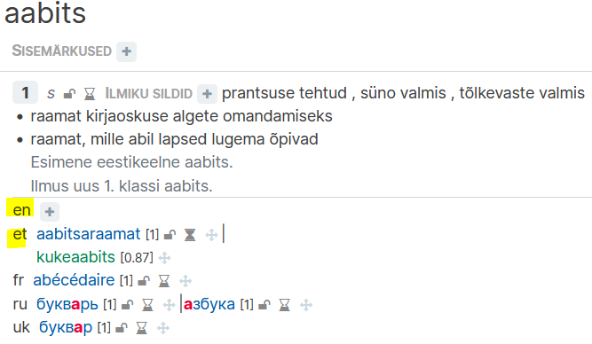
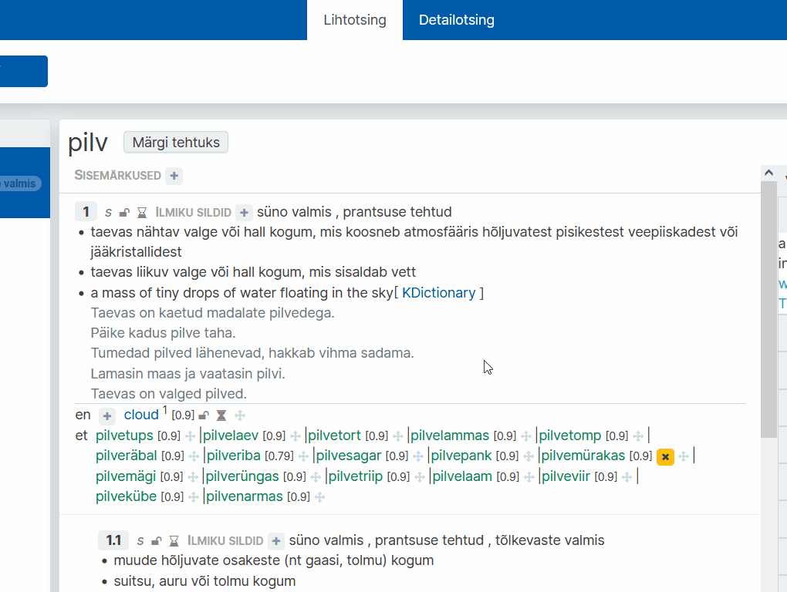

# Ekilexi kasutusjuhend

<button>[Avaleht](/index.md)</button>
<button>[Terminitöö sõnakoguga](/terminitoo.md)</button>
<button>[Tõlkevasted](/tolkevasted.md)</button>

## Tõlkevastete vaate juhend

### Sisukord
...

---
### Seadistus

Et kasutada Tõlkevastete vaadet, peate kõigepealt kindlaks tegema, et kasutaja seadistus on korrektne.

---

#### Ekilexi muutmisõiguste seadistus

Kõigepealt on vajalik, et teil oleks olemas **EKI Ühendsõnastiku** muutmisõigus **kõigis keeltes**, või vähemalt eesti keeles ja võõrkeeles mida tõlkevastete vaates kasutate.

Selle puudumisel on lihtsaim taotleda kõigis keeltes sõnakogu muutmisõigust.

1. Klõpsake üleval sinise riba paremal pool oma nimele ja avage **"Kasutaja profiili haldus"**.  
   
    <!--Pilt: Kasutaja klõpsamisel ilmuv rippmenüü-->

2. Profiilihalduse lehel, **"Esitatud õiguste taotlused"** all, on sinine nupp **"Esita uus taotlus"**. Sellele klõpsates avaneb taotluse saatmise aken. Vali **"EKI Ühendsõnastik 2023"** ja soovitud õiguseks **"Muutja"**. Jätke valitud keel lahter samaks, et seal oleks **"Kõik keeled"**. Lisage ka **põhjendus**, miks soovite sellele sõnakogule ligipääsu. Seejärel vajutage **"Saada taotlus"**.  
  
    <!--Pilt: Taotluse akna avamine ja täitmine-->

3. Taotluse info on nüüd näha **"Esitatud õiguste taotlused"** all.  
   
    <!--Pilt: Esitatud taotluse info tabelis-->

Ekilexi administraator kinnitab teie taotluse mõne aja jooksul.

---

#### Kasutajaliidese seadistus

Järgmiseks peate seadistama tõlkevastete vaate-spetsiifilised seaded?
<!--???????????????????????-->

1. Klõpsake üleval sinise riba paremal pool oma nimele ja avage **"Kasutaja profiili haldus"**.  
   
    <!--Pilt: Kasutaja klõpsamisel ilmuv rippmenüü-->

2. Profiilihalduse lehel **"Seaded"** all on nupp **"Muuda tähenduste seoste ja vastete kuva seadeid"**, klõpsake sellel. Avaneb uus aken.
   
    <!--Pilt: Tähenduste seoste ja vastete kuva seadete menüü avamine-->

3. Tõlkevastete vaate jaoks olulised on siin viimased kaks rippmenüüd. Valige **"Tõlkevastete kandidaatide sõnakogu"** alt kindel sõnakogu, mis teile vastete kandidaate varustama peaks, <!-- on juhendaja vms poolt antud-->ning **"Tõlkevastete kandidaatide keel"** alt mis keeles vasted olema hakkavad. Vajutage **"Salvesta"**.
   
    <!--Pilt: Menüü lõpus kahe rippmenüü sees vastava valiku tegemine-->

"Tõlkevastete kandidaatide sõnakogu" all valitud sõnakogu(näites "Inglise vasted") õiguseid ei ole vaja taotleda, et teha tööd Tõlkevastete vaates.

Kui on aga tahe näha vastete sõnakogu näiteks Leksikograafide või Terminoloogide vaate otsingutulemuste seas, tuleks taotleda kindla sõnakogu lugemis- või muutmisõigus.

---

#### Sünonüümid? kuidas seda paremini...?
Järgnev puudutab küll pigem Sünonüümide vaade tööd, aga seaded mõjutavad väljanägemist(?) üle kogu süsteemi.

Kui seadeid mitte muuta, näevad mõistekirjega ühendatud sünonüümid ja sõnavasted välja sellised. Iga saadaval oleva keele vasted on ekilexis mõistekirjes nähtaval.  
   
    <!--Pilt: ??-->

Kui aga valida Seadete alt "Muuda tähenduste seoste ja vastete kuva seadeid" aknast "Kuvatavate täissünonüümide keeled" alt vaid need keeled, mida kasutate tõlkevastete leidmisel,
   
    <!--Pilt: ??-->

Siis on näha vaid tööks valitud keelte vasted.  
   
    <!--Pilt: ??-->

---

#### Siltide seadistus

<!--????????????-->
Siltide lisamine või tõlkevaste tehtuks märkimine ei muuda funktsionaalsust. See aga annab teistele ekilexi kasutajatele teada, kuidas on terminitega tegeletud, või mida peaks kindla terminiga veel tegema. 

1. Klõpsake üleval sinise riba paremal pool oma nimele ja avage **"Kasutaja profiili haldus"**.  
   
    <!--Pilt: Kasutaja klõpsamisel ilmuv rippmenüü-->

2. Profiilihalduse lehel **"Seaded"** all on nupp **"Muuda siltide seadeid"**, klõpsake sellel. Avaneb uus aken. Sealt saate valida mõlemas rippmenüüs **"tõlkevaste valmis"**. Vajutage **"Salvesta"**.
   
    <!--Pilt: ??-->

Nüüd, kui olete lõpetanud töö tõlkevaste vaates, siis saate termini(?) märkida tehtuks.
   
    <!--Pilt: ??-->

Sama tulemuse saab ka, kui lisada **"ilmiku sildid"** juuresolevast plussmärgist sama silt.

---

### Tõlkevastete tööprotssess ???

Mitmekeelse sõnakogu koostamine toimub eelnevalt leitud vastekandidaatide alusel. Ekilexi on kindlasse sõnakogusse lisatud vastekandidaadid, mida kuvatakse otsitud termini alusel tõlkevastete vaates paremas tulbas. Nende kandidaatide kohta tuleb teha otsus, kas nad sobivad eestikeelsete märksõnade vasteks või mitte.  
   
    <!--Pilt: ??-->
Samuti on vaja otsustada, kas tõlkevaste on terminiga võrdne, või on vaja lisada see laiema või kitsama vastena.

(
kuidas koostada sõnastiku artiklit, 
- otsin eesti märksõna, 
- vaatan üle teiskeelsed vastekandidaadid(mis peaks ilmuma), 
- lohistan sõna õige termini(?) alla, 
- tuleb ette aken kus saan kas valida vastava termini/seletuse, või luua uue homonüümi.
)
---

#### Otsing

Tõlkevastete vaate otsing ja detailotsing funktsioneerivad samaviisi/samamoodi?, kui teistes vaadetes. Lugege lähemalt [siit](/terminitoo.md#terminite-otsing).

??otsisõna, kõik tähendused, otsisõna kandidaadid, tulevad automaatselt nimekirjast.

---

#### Võrdse vastekandidaadi lisamine mõistekirjesse

1. Avage töölaual link **"Tõlkevasted"**.

2. **Sisestage otsisõna**. Kasutada võite **metamärke**. Vajutage **"Otsi"**.

3. Valige paremal vastekandidaatide tulbast sobiv vaste, ning lohistage hiirenuppu all hoides see õige termini juurde.

    - Kui valitud vaste **ei esine** homonüümina üheski olemasolevas sõnakogus, siis lisandub see otsekohe vastena.
   
    <!--Pilt: ??-->

4. Kui sisestatud keelend **juba esineb** olemasolevas sõnakogus, tavaliselt vähemalt Ühendsõnastikus, avaneb uus aken "Vali sobiv keelend või loo uus". Siin kuvab süsteem teile sama kujuga homonüümid ja nende kirjed, mis on teistesse sõnastikesse ja terminibaasidesse lisatud.  

    1. Tehke linnuke selle tähendusega keelendi ette, mis sarnaneb teie omaga enim, ning vajutage "Vali keelend", et see lisanduks otsevastena kirjesse.  
   
    <!--Pilt: ??-->

    2. Kui ükski neist ei sarnane, saate teha keelendi ka uueks homonüümiks, vajutades "Loo uus homonüüm".  
   
    <!--Pilt: ??-->

Iga uue homonüümi loomisel läheb see ka nüüd valitavate homonüümide nimekirja. Mõte on, et ei tekitataks juurde uusi homonüüme ilmaasjata. (?????)

Vastekandidaatide tulbas, keelendi juures oleva graafiku ikooni peale minnes, on näha vastekandidaadi kaal. Mida suurem number, seda usaldusväärsemast allikast on see pärit. Kõrgem number on sõnastikest ja terminikogudest pärinevatel keelenditel, madalam aga nendel, mis on tõlkemäludest ja avalikest keelekorpustest.  
   
    <!--Pilt: ??-->

Samuti saab lisada vastekandidaate vastava keele lühendi kõrvalt plussmärki vajutades. Selle tagajärjel avaneb sarnane aken keelendi valimiseks või uue homonüümi andmiseks, aga siinkohal eelneb sellele otsingu teostamine.  
   
    <!--Pilt: ??-->

---

##### Vaste muutmine mõistekirjes

Kui tõlkevasteid on juba lisatud, saab neid mõistekirjes ka muuta.

Liikudes hiirega tõlkevaste peale, saate vajutada ruuduga ümbritsetud pliiatsi ikoonile, misjärel avaneb vaste kaalu muutmise aken. Selles saate muuta komaga arvu, et suurendada või vähendada vaste kaalu. See ei ilmu sõnvaveebis ja on vaid süsteemisisene märge/muutuja(???).
   
    <!--Pilt: ??-->

Liikudes hiirega tõlkevaste peale, saate vajutada allasuunavale/näitavale noole ikoonile, mis avab rippmenüü vaste lihtsuse muutmise jaoks. "Lihtne" ja "Lihtne/Detailne" märgiga vasted on nähtaval keeleõppija sõnaveebis, "Detailne" märgiga aga mitte(kas sain õigesti aru??).
   
    <!--Pilt: ??-->

Liikudes hiirega tõlkevaste peale, saate vajutada kollasele x nupule, et kustutada vaste selle termini alt. See toiming ei kustuta vastet parempoolsest vastekandidaatide reast.
   
    <!--Pilt: ??-->

Liikudes hiirega tõlkevaste peale, saate lõpus oleva ristnoolte(???) ikooni peal vajutades ja lohistades liigutada vastet, et muuta sõnade ilmumise järjekorda sõnaveebis.  
   
    <!--Pilt: ??-->

---

#### Vastekandidaadi nupufunktsioonid (??)

Paremas tulbas iga vastekandidaadi juures on sünonüümivaatest üle kantud nupud. 
Nendega saate märkida vaste mittetegeletuks, kinnitatuks või kustutatuks(lükata nimekirja lõppu). Tõlkevastete vaates nendel hetkel funktsionaalsus puudub, kuna sõnakogu on mitteavalik, ning ei ilmu sõnaveebis.  
   
    <!--Pilt: ??-->

Ainus oluline nupp siin on hall lüliti, mille kasutus on kirjeldatud järgmises peatükis.  
   
    <!--Pilt: ??-->

---

#### Laiema/kitsama tõlkevaste tähendus

<!-- ???????????????????????????? -->
Tõlkevasted saavad olla terminiga kas võrdsed, sellest kitsama tähendusega, või sellest laiema tähendusega.
Võrdse(??) tähendusega vaste on sama tähendusega kui termin. Näiteks viski ja whiskey
(lisa pilt?)

Kitsama tähendusega vaste on... nagu termini alamliik?? On spetsiifilisema tähendusega. Näiteks viski vaste bourbon, mis on viski, aga spetsiifilisema tähendusega (Ameerika viski) ehk Ameerikas tehtud. 
(lisa pilt??)

Laiema tähendusega vaste on nagu ülemliik?? Katusetermin. Mis on noh laiema tähendusega. Näiteks viski on alkohoolne jook, aga alkoholi alla lähevad ka paljud teised mõisted, nii et "alcohol" oleks laiema tähendusega. 
(kas ma saan siia pilti lisada..)

?? kas ma sain õigesti aru? Kas see on üldse midagi mida ma peaks leksikograafidele ette kirjutama või teavad nad juba palju paremini kui ma kuidas see täpselt käib.
also kas ma teeks nende kohta hoopis mingi joonise? a-la termini ja mõiste erinevus

##### Laiema/kitsama vaste lisamine

Kui vastekandidaat ei ole terminile täpselt vastav, vaid kitsam või laiem, saab seda nii ka mõistekirjes märkida.

äkki kaks viisi, et üks kui on täpne eestikeelne vaste olemas, ja teine kui ei ole?? saab ka lic vajutada enterit???

1. Enne kandidaadi termini peale lohistamist klõpsake lüliti paremale poole, et see muutub siniseks. Seejärel lohistage vastekandidaat termini juurde. Avaneb uus aken tähenduse valimise jaoks.  
   
    <!--Pilt: ??-->

2. **Tähenduse valimine**  
Sisestage lahtrisse tõlkevaste eestikeelne tähendus, või tähenduse kirjeldus. Valige sobiv eestikeelne tähenduse vaste ja vajutage "Järgmine samm". Kui sobivat tähendust ei leidu, vajutage "Sobiv tähendus puudub, loon uue" ja siis "Järgmine samm".  
   
    <!--Pilt: ??-->

3. **Tähenduse täiendamine**  
On võimalik, et tõlke- või eestikeelne vaste vajab täiendamist, ka siis kui ei vajutatud eelmisel lehel "Sobiv tähendus puudub, loon uue". Mõlemal juhul saate "Tähenduse täiendamine" lehel valida ühele või mõlemale keelendile sobivaima tähenduse, või hoopis luua uue. (????)
   
    <!--Pilt: ??-->

4. **Tähenduse seose loomine**  
Saate valida tähenduse seose, kas lisatav vaste on algterminist kitsam või laiem. Vajutage "Loo tähenduse seos".
   
    <!--Pilt: ??-->

Kui eestikeelse vaste lisamisel jätsite lahtri tühjaks, siis teisel sammul "Tähenduse täiendamine" küsitakse teilt ka "Lühivihje" lisamist. See võib olla näiteks lühikirjeldus terminist, mis viitab selle seosele katusmõistega.
   
    <!--Pilt: ??-->

---

##### Uue vastekandidaadi lisamine

Kui automaatselt tuvastatud kandidaatide seas pole sobivat vastet, saab selle ise käsitsi lisada.

Saab lisada kandidaadi otse keelendi juures(?). Sealt lisades läheb see automaatselt ainult otsevasteks.   
   
    <!--Pilt: ??-->

Saab ka lisada kandidaati paremal tulba kohal olebast plussmärgist. See viis lisab selle vastekandidaatide tulpa, ning võimaldab lisada seda nii otsevastena kui ka kitsama või laiema vastena.   
   
    <!--Pilt: ??-->
---

### Keelendiga töö lõpetamine

Koostamisel, kui vasted on kõik lohistatud ja sõnaga on tegeletud, siis vajutada nuppu "Märgi tehtuks". Siis tekib keelendile "tõlkevaste valmis" silt. See on töö protsessi jälgimise mõttes.   
   
    <!--Pilt: ??-->