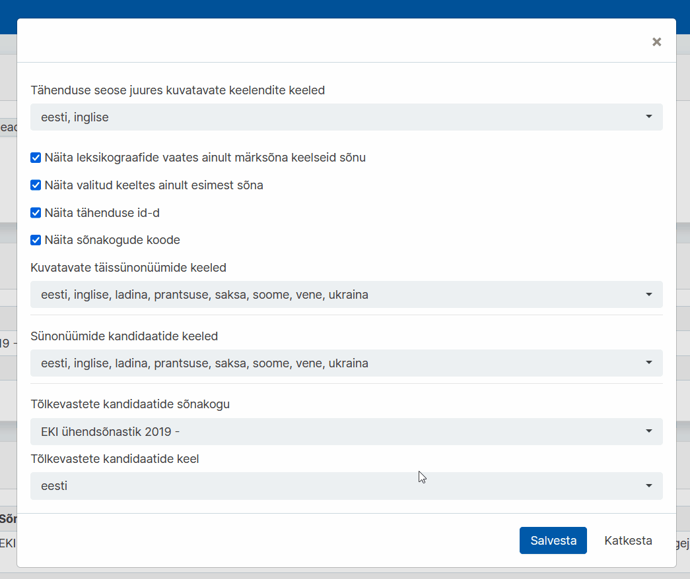

# Ekilexi kasutusjuhend

<button>[Avaleht](/index.md)</button>
<button>[Terminitöö sõnakoguga](/terminitoo.md)</button>
<button>[Tõlkevasted](/tolkevasted.md)</button>

## Tõlkevastete vaade

### Sisukord
- [Seadistus](#seadistus)
    - [Ekilexi muutmisõiguste seadistus](#ekilexi-muutmisõiguste-seadistus)
    - [Kasutajaliidese seadistus](#kasutajaliidese-seadistus)
    - [Siltide seadistus](#siltide-seadistus)
- [Tõlkevastete lisamise tööprotsess](#tõlkevastete-lisamise-tööprotsess)
    - [Otsing](#otsing)
    - [Otsevaste lisamine ilmikusse](#otsevaste-lisamine-ilmikusse)
        - [Vaste muutmine ilmikus](#vaste-muutmine-ilmikus)
    - [Vastekandidaadi nupufunktsioonid](#vastekandidaadi-nupufunktsioonid)
    - [Laiema/kitsama tõlkevaste tähendus](#laiemakitsama-tõlkevaste-tähendus)
        - [Laiema/kitsama vaste lisamine](#laiemakitsama-vaste-lisamine)
    - [Vastekandidaadi lisamine, mis puudub loendis](#vastekandidaadi-lisamine-mis-puudub-loendis)
    
---

### Seadistus

Et kasutada Tõlkevastete vaadet, peate kõigepealt kindlaks tegema, et kasutaja seadistus on korrektne.

---

#### Ekilexi muutmisõiguste seadistus

Kõigepealt on vajalik, et Teil oleks olemas **EKI Ühendsõnastiku** muutmisõigus **kõigis keeltes**, või vähemalt eesti keeles ja võõrkeeles, mida tõlkevastete vaates kasutate.

Selle puudumisel on lihtsaim taotleda kõigis keeltes sõnakogu muutmisõigust.

1. Klõpsake üleval oma nimele ja avage **"Kasutaja profiili haldus"**.  
   
    <!--Pilt: Kasutaja klõpsamisel ilmuv rippmenüü-->

2. Profiilihalduse lehel, **"Esitatud õiguste taotlused"** all, on sinine nupp **"Esita uus taotlus"**. Sellele klõpsates avaneb taotluse saatmise aken. Vali **"EKI Ühendsõnastik 2023"** ja soovitud õiguseks **"Muutja"**. Jätke valitud keele lahter samaks, et seal oleks **"Kõik keeled"**. Lisage ka **põhjendus**, miks soovite sellele sõnakogule ligipääsu. Seejärel vajutage **"Saada taotlus"**.  
  
    <!--Pilt: Taotluse akna avamine ja täitmine-->

3. Taotluse info on nüüd näha **"Esitatud õiguste taotlused"** all.  
   
    <!--Pilt: Esitatud taotluse info tabelis-->

Ekilexi administraator kinnitab Teie taotluse mõne aja jooksul.

---

#### Kasutajaliidese seadistus

Järgmiseks tuleb seadistada oma kasutaja profiili.

1. Klõpsake üleval oma nimele ja avage **"Kasutaja profiili haldus"**.  
   
    <!--Pilt: Kasutaja klõpsamisel ilmuv rippmenüü-->

2. Profiilihalduse lehel **"Seaded"** all on nupp **"Muuda tähenduste seoste ja vastete kuva seadeid"**, klõpsake sellel. Avaneb uus aken. Osutage tähelepanu, et **"Näita valitud keeltes ainult esimest sõna"** ees ei oleks linnukest.
   
    <!--Pilt: Tähenduste seoste ja vastete kuva seadete menüü avamine-->

<!-- kommenteeritud välja praeguseks, kuna süsteem vist muutub?? -->
<!--3. Tõlkevastete vaate jaoks olulised on viimased kaks rippmenüüd. Valige **"Tõlkevastete kandidaatide sõnakogu"** alt kindel sõnakogu, mis Teid vastete kandidaatidega varustama peaks, (??) ning **"Tõlkevastete kandidaatide keel"** alt, mis keeles vasted olema hakkavad. Vajutage **"Salvesta"**.  
/**/
    <!--Pilt: Menüü lõpus kahe rippmenüü sees vastava valiku tegemine

"Tõlkevastete kandidaatide sõnakogu" all valitud sõnakogu (näites "Inglise vasted") õiguseid **ei ole vaja taotleda**, et teha tööd Tõlkevastete vaates.

Kui on tahe näha vastete sõnakogu näiteks Leksikograafide või Terminoloogide vaate otsingutulemuste seas, tuleks taotleda kindla sõnakogu lugemis- või muutmisõigus.-->

3. Tõlkevastete koostajana tehke kindlaks, et seadistuses **"Kuvatavate täissünonüümide keeled"** ja **"Sünonüümide kandidaatide keeled"** lahtrites on esindatud keeled, mille vastetega töö toimub.  
   
    <!--Pilt: ??-->  
    
    Muutmise tulemusena kuvatakse vaates tööks valitud keelte vasted.  
   
    <!--Pilt: ??-->

Süsteem on veel arendamisel, plaan on inglise vasted importida otse Ühendsõnastikku. Vastete loendite genereerimisega tegeletakse. 

---

#### Siltide seadistus

Tõlkevastete koostamise juures on tööjärje pidamiseks oluline teada, milliste keelenditega on juba tegeletud ja millistega mitte, mistõttu tuleks koostatud keelendid **tegeletuks** märkida.  
Selleks tuleb kasutaja profiilist valida vastav **silt**, mida siis tõlkevastete vaates ühe nupuvajutusega kõigile ilmikutele lisada saab.  

1. Klõpsake üleval oma nimele ja avage **"Kasutaja profiili haldus"**.  
   
    <!--Pilt: Kasutaja klõpsamisel ilmuv rippmenüü-->

2. Profiilihalduse lehel Seadete alt klõpsake nupul **"Muuda siltide seadeid"**. Avanenud aknas valige mõlemas rippmenüüs **"tõlkevaste valmis"**. Vajutage **"Salvesta"**.  
   
    <!--Pilt: ??-->

3. Kui tõlkevastete vaates koostatava keelendi kõik tähendused on võõrkeelsete vastetega varustatud ja te olete veendunud, et sõnaartikkel on koostatud, vajutage nuppu **"Märgi tehtuks"**. Keelendile lisandub silt **"tõlkevaste valmis"**.  
   
    <!--Pilt: ??-->

---

### Tõlkevastete lisamise tööprotsess

Mitmekeelse sõnakogu koostamine toimub eelnevalt leitud **vastekandidaatide** alusel. Ekilexi kindlasse sõnakogusse on lisatud vastekandidaadid, mida kuvatakse otsitud termini alusel tõlkevastete vaates paremas tulbas.  
Nende kandidaatide kohta tuleb teha otsus, kas nad sobivad eestikeelse keelendi tähenduste vasteks või mitte.  
   
    <!--Pilt: ??-->

Lisaks on vaja otsustada, kas tõlkevaste on terminiga **võrdne** või on vaja see lisada **laiema või kitsama** vastena.  
Näiteks sõnal *abikaasa* on inglise keeles mitu vastet, millest *spouse* on otsevaste, *husband* (meessoost abikaasa) ja *wife* (naissoost abikaasa) aga kitsamad vasted.

---

#### Otsing

Lihtotsing ja detailotsing funktsioneerivad kõikides vaadetes üheselt. Lugege lähemalt [siit](/terminitoo.md#terminite-otsing).

---

#### Otsevaste lisamine ilmikusse

1. Avage töölaual link **"Tõlkevasted"**.

2. **Sisestage otsisõna**. Kasutada võite **metamärke**. Vajutage **"Otsi"**.

3. Valige paremalt **vastete kandidaatide** tulbast sobiv vaste, ning lohistage hiirenuppu all hoides see õige termini juurde.  

    - Kui valitud vaste **ei esine** homonüümina üheski olemasolevas sõnakogus, siis lisandub see otsekohe vastena.  
   
    <!--Pilt: ??-->

4. Kui sisestatud keelend **juba esineb** Ekilexis olemasolevas sõnakogus või terminibaasis, avaneb uus aken **"Vali sobiv keelend või loo uus"**. Siin kuvab süsteem Teile sama kujuga homonüümid ja nende kirjed, mis on sõnakogudesse juba lisatud.  

    1) Kui õige tähendusega homonüüm on Ekilexis juba olemas, tehke linnuke selle ette ning vajutage **"Vali keelend"**, et see lisanduks otsevastena kirjesse.  
   
    <!--Pilt: ??-->

    2) Kui ükski keelenditest ei sarnane, saate teha vaste ka uueks homonüümiks, vajutades **"Loo uus homonüüm"**.  
   
    <!--Pilt: ??-->

Iga uue homonüümi loomisel läheb see ka valitavate homonüümide nimekirja. Võimalusel tuleks hinnata uute homonüümide lisamise otstarbekust.

Vastete kandidaatide tulbas, keelendi juures oleva **graafiku ikooni** peale liikudes, on näha vastekandidaadi kaal. Kõige kõrgem number (ehk kaal) 0.9 on sõnastikest pärit kandidaatidel, 0.8 tõlkemäludest ja 0.7 avalikest korpustest pärinevatel keelenditel. Kandidaadid on paremal veerus esitatud kaalu tugevuse järgi.  
   
    <!--Pilt: ??-->

Vastekandidaate saab lisada ka vastava keele lühendi kõrvalt **plussmärgile** vajutades. Selle tagajärjel avaneb punktis 4. kuvatule sarnane aken keelendi valimiseks või uue homonüümi lisamiseks, aga siinkohal eelneb sellele otsingu teostamine. Selle abil saab lisada **ainult** otsevasteid.  
   
    <!--Pilt: ??-->

---

##### Vaste muutmine ilmikus

Lisatud tõlkevasteid saab ilmikus vajadusel ka muuta.

Vaste kaalu muutmiseks liikuge hiirega tõlkevaste peale ja vajutage **ruuduga ümbritsetud pliiatsi nupule**. Avanevas aknas saate suurendada või vähendada vaste kaalu väljendavat numbrit, mis ei ilmu sõnaveebis ja on süsteemisisene märge.  
   
    <!--Pilt: ??-->

Vaste lihtsuse muutmiseks liikuge hiirega tõlkevaste peale ja vajutage **noole nupule**. Avanevas rippmenüüs kuvatavad **"Lihtne"** ja **"Lihtne/Detailne"** märgiga vasted on nähtaval keeleõppija sõnaveebis, **"Detailne"** märgiga mitte.  
   
    <!--Pilt: ??-->

Vaste kustutamiseks ilmiku küljest liikuge hiirega tõlkevaste peale ja vajutage **kollasele x nupule**. See toiming ei kustuta vastet parempoolsest vastekandidaatide reast, vaid liigutab selle kandidaatide loendi lõppu.  
   
    <!--Pilt: ??-->

Vaste liigutamiseks liikuge hiirega tõlkevaste lõpus oleva **ristnooltega ikooni** peale. Ikooni vajutades ja lohistades saate muuta sõnade ilmumise järjekorda sõnaveebis.  
   
    <!--Pilt: ??-->

---

#### Vastekandidaadi nupufunktsioonid

Paremas tulbas iga vastekandidaadi juures on sünonüümivaatest üle kantud nupud. 
Nendega saate märkida vaste mittetegeletuks, kinnitatuks või kustutatuks (lükata nimekirja lõppu). Kuna sõnakogu on mitteavalik ja ei ilmu sõnaveebis, siis tõlkevastete vaates nendel nuppudel hetkel **funktsionaalsus puudub**.  
   
    <!--Pilt: ??-->

Olulisim nupp on hall **lüliti**, mille kasutamist kirjeldatakse laiema/kitsama vaste lisamise alapeatüki juures.  
   
    <!--Pilt: ??-->

---

#### Laiema/kitsama tõlkevaste tähendus

Tõlkevasted saavad olla terminiga kas **võrdsed**, **kitsama tähendusega** või **laiema tähendusega**.
Otsevaste on **sama tähendusega** kui termin. Näiteks *abikaasa* ja *spouse*.
<!--(lisa pilt?)-->

Kitsama tähendusega vaste on **spetsiifilisema tähendusega**. Näiteks *abikaasa* vasted on ka *wife* ja *husband*, millest esimene viitab naisoost ja teine meessoost abikaasale.
<!--(lisa pilt??)-->

<!--Laiema tähendusega vaste on nagu ülemliik?? Katusetermin. Mis on noh laiema tähendusega. Näiteks viski on alkohoolne jook, aga alkoholi alla lähevad ka paljud teised mõisted, nii et alcohol oleks laiema tähendusega. -->
<!--ütles et ma need hoopis kustutaks.-->

---

##### Laiema/kitsama vaste lisamine

Kui vastekandidaat ei vasta täpselt tähendusele, vaid on sellest **kitsam** või **laiem**, saab seda nii ka ilmikus märkida.

1. Enne kandidaadi termini juurde lohistamist klõpsake **hall lüliti** sisselülitatud asendisse ehk siniseks. Seejärel lohistage vastekandidaat termini juurde. Avaneb uus aken tähenduse valimiseks.  
   
    <!--Pilt: ??-->

2. **Tähenduse valimine**  
Sisestage lahtrisse tõlkevaste eestikeelne vaste ja vajutage **"Otsi"**. Juhul, kui see on Ekilexis olemas, kuvatakse keelendi tähendus(ed). Märkige sobiv tähenduse vaste ja vajutage **"Järgmine samm"**. Kui sobivat tähendust ei leidu, märgistage **"Sobiv tähendus puudub, loon uue"** ja siis vajutage **"Järgmine samm"**.  
   
    <!--Pilt: ??-->

3. **Tähenduse täiendamine**  
Kui tõlke- või eestikeelne vaste vajab täiendamist (näiteks ka siis kui ei valitud eelmisel lehel **"Sobiv tähendus puudub, loon uue"**), siis saate "Tähenduse täiendamine" lehel valida ühele või mõlemale keelendile sobivaima või luua uue tähenduse. Edasiliikumiseks vajutage **"Järgmine samm"**.  
   
    <!--Pilt: ??-->

4. **Tähenduse seose loomine**  
Tähenduse seose loomiseks valige rippmenüüst kas lisatava vaste tähendus on tõlgitavast keelendist **kitsam** või **laiem**. Vajutage **"Loo tähenduse seos"**.  
   
    <!--Pilt: ??-->

Kui "Tähenduse valimisel" jätsite eestikeelse vaste lahtri täitmata, siis teisel sammul "Tähenduse täiendamine" küsitakse Teilt ka **"Lühivihje"** lisamist. Selleks võib olla näiteks lühikirjeldus terminist, mis viitab seosele katusmõistega. Saate edasi liikuda "Tähenduse seose loomine" aknasse, mis on eelnevalt kirjeldatud.  
   
    <!--Pilt: ??-->
<!-- siia küsida madiselt legitiimseid näiteid?-->

---

#### Vastekandidaadi lisamine, mis puudub loendis

Kui automaatselt genereeritud vastete kandidaatide loendis **pole sobivat vastet**, saab selle ise käsitsi lisada.

Kui tahate lisada otsevaste, mida kandaatide loendis ei ole, saate seda teha **kahest kohast**: paremal veerus olevate kandidaatide rea kohal oleval plussmärgil või ilmikus oleval plussmärgil vajutades.  

Kui tahate lisada sellist **kitsamat/laiemat** vastet, mida kandidaatide loendis pole, saate seda teha ainult paremal kandidaatide kohal oleva **plussmärgi** abil, sest kitsama/laiema vaste märkimise funktsionaalsus on **ainult seal**.  
   
    <!--Pilt: ??-->

Uue **otsevaste** kandidaadi saab lisada vajutades ilmikus oleva keele lühendi kõrval olevale plussmärgiga nupule. Avaneb aken **"Vali sobiv keelend või loo uus"** kus saab teostada otsingu keelendi leidmiseks. Seejärel saab märgistada ilmunud valikust sobiva homonüümi, või luua uue.
   
    <!--Pilt: ??--> 

---

Küsimuste korral kirjuta [kasutajatugi@ekilex.ee](mailto:kasutajatugi@ekilex.ee)!

Süsteemi alles arendatakse, mistõttu juhend täieneb.  
Andke julgelt juhendi kohta tagasisidet aadressil (kas ma panen oma emaili siia???)